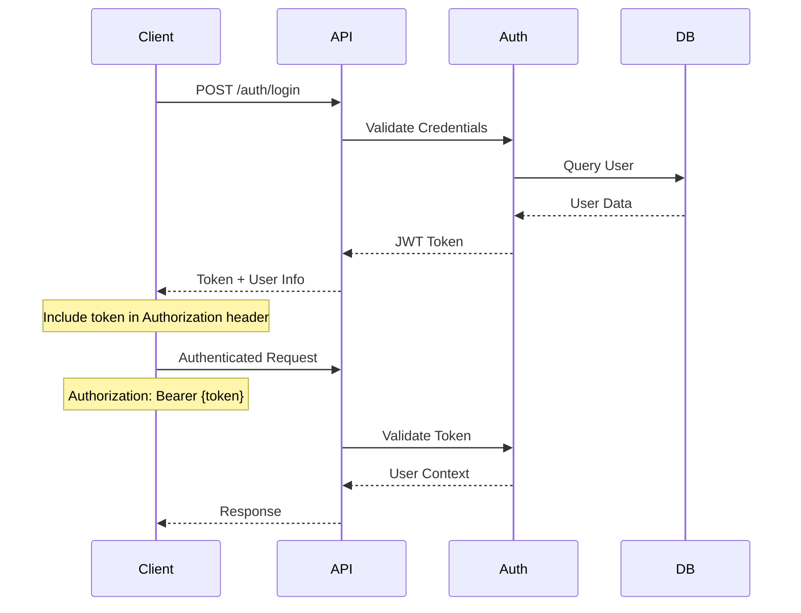

# API Endpoints Documentation

This document provides comprehensive documentation for all API endpoints in the gift card platform, including
request/response formats, authentication requirements, and implementation status.

## Base URL

- **Production**: `https://your-domain.com`
- **Development**: `http://localhost:3333`
- **API Base**: `{domain}/api/v1`
- **Webhooks**: `{domain}/webhooks`

## Authentication

The API uses JWT (JSON Web Token) based authentication with role-based access control.

### Authentication Flow



### User Roles

- **FRANCHISOR**: System administrators with full access
- **FRANCHISEE**: Franchise owners managing gift cards and establishments
- **ESTABLISHMENT**: Local businesses that handle gift card operations

## Response Format

### Success Response Structure

```json
{
  "data": {
    /* response data */
  },
  "meta": {
    /* pagination info when applicable */
  }
}
```

### Error Response Structure

```json
{
  "errors": [
    {
      "message": "Error description",
      "code": "ERROR_CODE",
      "field": "fieldName"
      // for validation errors
    }
  ]
}
```

### Status Codes

- `200` - Success
- `201` - Created
- `204` - No Content
- `400` - Bad Request (validation errors)
- `401` - Unauthorized
- `403` - Forbidden
- `404` - Not Found
- `422` - Unprocessable Entity
- `500` - Internal Server Error

## Health Check Endpoints

### System Health

```http
GET /
```

**Authentication**: None  
**Response**: `200 OK`

```json
{
  "name": "Gift Card Platform API",
  "version": "1.0.0",
  "status": "active",
  "environment": "development"
}
```

### Health Check

```http
GET /health
```

**Authentication**: None  
**Response**: `200 OK`

```json
{
  "status": "ok",
  "timestamp": "2025-01-06T12:00:00.000Z"
}
```

## Authentication Endpoints

### Login

```http
POST /api/v1/auth/login
```

**Authentication**: None  
**Request Body**:

```json
{
  "email": "user@example.com",
  "password": "password123"
}
```

**Response**: `200 OK`

```json
{
  "user": {
    "id": 1,
    "fullName": "John Doe",
    "email": "john@example.com",
    "role": "franchisee",
    "status": "active"
  },
  "token": "eyJhbGciOiJIUzI1NiIsInR5cCI6IkpXVCJ9..."
}
```

### Register

```http
POST /api/v1/auth/register
```

**Authentication**: None  
**Request Body**:

```json
{
  "fullName": "John Doe",
  "email": "john@example.com",
  "password": "password123",
  "password_confirmation": "password123",
  "phone": "+5511999999999",
  "role": "establishment"
}
```

**Response**: `201 Created`

### Get Current User

```http
GET /api/v1/auth/me
```

**Authentication**: Required  
**Headers**: `Authorization: Bearer {token}`  
**Response**: `200 OK`

```json
{
  "user": {
    "id": 1,
    "fullName": "John Doe",
    "email": "john@example.com",
    "role": "franchisee",
    "status": "active",
    "createdAt": "2025-01-01T00:00:00.000Z"
  }
}
```

### Logout

```http
POST /api/v1/auth/logout
```

**Authentication**: Required  
**Response**: `200 OK`

```json
{
  "success": true,
  "message": "Logged out successfully"
}
```

### Refresh Token ⚠️

```http
POST /api/v1/auth/refresh
```

**Status**: Placeholder implementation  
**Authentication**: None  
**Response**: `200 OK`

```json
{
  "message": "Refresh token endpoint - to be implemented"
}
```

## Franchisee Management

### List Franchisees

```http
GET /api/v1/franchisees
```

**Authentication**: Required (franchisor)  
**Query Parameters**:

- `page` (optional): Page number (default: 1)
- `perPage` (optional): Items per page (max: 100, default: 20)
- `sortBy` (optional): `id|companyName|createdAt` (default: id)
- `order` (optional): `asc|desc` (default: asc)
- `status` (optional): `active|inactive|suspended`
- `search` (optional): Search in company name and email

**Response**: `200 OK`

```json
{
  "data": [
    {
      "id": 1,
      "code": "FR001",
      "companyName": "Franchise ABC",
      "cnpj": "12.345.678/0001-90",
      "commissionRate": 5.0,
      "status": "active",
      "user": {
        "id": 1,
        "fullName": "John Doe",
        "email": "john@example.com"
      },
      "createdAt": "2025-01-01T00:00:00.000Z"
    }
  ],
  "meta": {
    "total": 100,
    "perPage": 20,
    "currentPage": 1,
    "lastPage": 5
  }
}
```

### Get Franchisee

```http
GET /api/v1/franchisees/:id
```

**Authentication**: Required (franchisor)  
**Query Parameters**:

- `include` (optional): Set to "relations" to include establishments

**Response**: `200 OK`

```json
{
  "id": 1,
  "code": "FR001",
  "companyName": "Franchise ABC",
  "cnpj": "12.345.678/0001-90",
  "address": {
    "street": "Main Street",
    "number": "123",
    "city": "São Paulo",
    "state": "SP",
    "zipCode": "01234-567"
  },
  "commissionRate": 5.0,
  "status": "active",
  "user": {
    /* user object */
  },
  "establishments": [
    /* establishments array if included */
  ]
}
```

### Get Franchisee by Code

```http
GET /api/v1/franchisees/code/:code
```

**Authentication**: Required (franchisor)  
**Response**: Same as Get Franchisee

### Create Franchisee

```http
POST /api/v1/franchisees
```

**Authentication**: Required (franchisor)  
**Request Body**:

```json
{
  "userId": 1,
  "companyName": "Franchise ABC",
  "cnpj": "12.345.678/0001-90",
  "address": {
    "street": "Main Street",
    "number": "123",
    "complement": "Suite 1",
    "neighborhood": "Downtown",
    "city": "São Paulo",
    "state": "SP",
    "zipCode": "01234-567"
  },
  "commissionRate": 5.5
}
```

**Response**: `201 Created`

### Update Franchisee

```http
PUT /api/v1/franchisees/:id
```

**Authentication**: Required (franchisor)  
**Request Body**: Same as Create (all fields optional)  
**Response**: `200 OK`

### Delete Franchisee

```http
DELETE /api/v1/franchisees/:id
```

**Authentication**: Required (franchisor)  
**Response**: `204 No Content`

### Franchisee Profile ⚠️

```http
GET /api/v1/franchisee/profile
PUT /api/v1/franchisee/profile
```

**Status**: Placeholder implementation  
**Authentication**: Required (franchisee)

## Establishment Management

### List Establishments ⚠️

```http
GET /api/v1/establishments
```

**Status**: Placeholder implementation  
**Authentication**: Required (franchisee, franchisor)  
**Response**: Empty data array

### Create Establishment

```http
POST /api/v1/establishments
```

**Authentication**: Required (franchisee, franchisor)  
**Request Body**:

```json
{
  "userId": 1,
  "franchiseeId": 1,
  "name": "Salon ABC",
  "cnpj": "12.345.678/0001-90",
  "category": "salon",
  "address": {
    "street": "Business Street",
    "number": "456",
    "city": "São Paulo",
    "state": "SP",
    "zipCode": "01234-567"
  },
  "paymentMethodDefault": "pix"
}
```

**Categories**: `salon|gym|cafe|restaurant|store|clinic|other`  
**Payment Methods**: `ticket|pix|credit_card`  
**Response**: `201 Created`

### Get/Update/Delete Establishment ⚠️

```http
GET /api/v1/establishments/:id
PUT /api/v1/establishments/:id
DELETE /api/v1/establishments/:id
```

**Status**: Placeholder implementation

### Establishment Profile ⚠️

```http
GET /api/v1/establishment/profile
PUT /api/v1/establishment/profile
GET /api/v1/establishment/transactions
GET /api/v1/establishment/gift-cards
```

**Status**: Placeholder implementation  
**Authentication**: Required (establishment)

## Gift Card Operations

### Check Balance (Public)

```http
GET /api/v1/gift-cards/balance?code=GC-ABCD-EFGH-IJKL-MNOP
```

**Authentication**: None  
**Query Parameters**:

- `code` (required): Gift card code

**Response**: `200 OK`

```json
{
  "code": "GC-ABCD-EFGH-IJKL-MNOP",
  "currentBalance": 150.00,
  "initialValue": 200.00,
  "status": "active",
  "validUntil": "2025-12-31T23:59:59.000Z",
  "establishment": {
    "name": "Salon ABC",
    "category": "salon"
  }
}
```

### Create Gift Card

```http
POST /api/v1/gift-cards
```

**Authentication**: Required  
**Request Body**:

```json
{
  "franchiseeId": 1,
  "establishmentId": 1,
  "initialValue": 100.00,
  "validUntil": "2025-12-31T23:59:59.000Z"
}
```

**Response**: `201 Created`

```json
{
  "id": 1,
  "code": "GC-ABCD-EFGH-IJKL-MNOP",
  "qrCode": "data:image/png;base64,iVBORw0KGgoAAAANSUhEUgAA...",
  "initialValue": 100.00,
  "currentBalance": 100.00,
  "status": "active",
  "validUntil": "2025-12-31T23:59:59.000Z"
}
```

### Create Gift Cards in Batch

```http
POST /api/v1/gift-cards/batch
```

**Authentication**: Required  
**Request Body**:

```json
{
  "franchiseeId": 1,
  "establishmentId": 1,
  "quantity": 10,
  "initialValue": 100.00,
  "validUntil": "2025-12-31T23:59:59.000Z"
}
```

**Response**: `201 Created`

```json
{
  "createdCount": 10,
  "giftCards": [
    {
      "code": "GC-ABCD-EFGH-IJKL-MNOP",
      "qrCode": "data:image/png;base64,..."
    }
  ]
}
```

### Recharge Gift Card

```http
POST /api/v1/gift-cards/recharge
```

**Authentication**: Required  
**Request Body**:

```json
{
  "giftCardId": 1,
  "amount": 50.00,
  "establishmentId": 1,
  "description": "Account recharge"
}
```

**Response**: `200 OK`

```json
{
  "transaction": {
    "id": 1,
    "type": "recharge",
    "amount": 50.00,
    "balanceBefore": 100.00,
    "balanceAfter": 150.00,
    "description": "Account recharge"
  },
  "giftCard": {
    "currentBalance": 150.00
  },
  "commission": {
    "id": 1,
    "amount": 2.50,
    "rate": 5.0,
    "status": "pending"
  }
}
```

### Recharge Gift Card by Code

```http
POST /api/v1/gift-cards/recharge/code
```

**Authentication**: Required  
**Request Body**:

```json
{
  "code": "GC-ABCD-EFGH-IJKL-MNOP",
  "establishmentId": 1,
  "amount": 50.00,
  "description": "Account recharge"
}
```

**Response**: Same as recharge by ID

### Use Gift Card

```http
POST /api/v1/gift-cards/use
```

**Authentication**: Required  
**Request Body**:

```json
{
  "giftCardId": 1,
  "amount": 25.00,
  "establishmentId": 1,
  "description": "Service payment"
}
```

**Response**: `200 OK`

```json
{
  "transaction": {
    "id": 2,
    "type": "usage",
    "amount": 25.00,
    "balanceBefore": 150.00,
    "balanceAfter": 125.00,
    "description": "Service payment"
  },
  "giftCard": {
    "currentBalance": 125.00
  }
}
```

### Use Gift Card by Code

```http
POST /api/v1/gift-cards/use/code
```

**Authentication**: Required  
**Request Body**:

```json
{
  "code": "GC-ABCD-EFGH-IJKL-MNOP",
  "establishmentId": 1,
  "amount": 25.00,
  "description": "Service payment"
}
```

**Response**: Same as use by ID

## Transaction Management

### List Transactions

```http
GET /api/v1/transactions
```

**Authentication**: Required  
**Query Parameters**:

- `page`, `perPage`: Pagination
- `sortBy`: `id|amount|createdAt` (default: createdAt)
- `order`: `asc|desc` (default: desc)
- `giftCardId`: Filter by gift card
- `establishmentId`: Filter by establishment
- `type`: `recharge|usage|refund`
- `startDate`, `endDate`: Date range (ISO format)
- `minAmount`, `maxAmount`: Amount range

**Response**: `200 OK`

```json
{
  "data": [
    {
      "id": 1,
      "type": "recharge",
      "amount": 50.00,
      "balanceBefore": 100.00,
      "balanceAfter": 150.00,
      "description": "Account recharge",
      "giftCard": {
        "code": "GC-ABCD-EFGH-IJKL-MNOP"
      },
      "establishment": {
        "name": "Salon ABC"
      },
      "createdAt": "2025-01-01T10:00:00.000Z"
    }
  ],
  "meta": {
    /* pagination info */
  }
}
```

### Get Transaction

```http
GET /api/v1/transactions/:id
```

**Authentication**: Required  
**Response**: `200 OK` - Single transaction object

### Transaction Summary

```http
GET /api/v1/transactions/summary
```

**Authentication**: Required  
**Query Parameters**:

- `giftCardId`, `establishmentId`, `franchiseeId`: Filter scope
- `startDate`, `endDate`: Date range

**Response**: `200 OK`

```json
{
  "totalRecharges": 1000.00,
  "totalUsages": 600.00,
  "totalRefunds": 50.00,
  "netBalance": 450.00,
  "transactionCount": {
    "recharges": 10,
    "usages": 15,
    "refunds": 2
  },
  "period": {
    "start": "2025-01-01T00:00:00.000Z",
    "end": "2025-01-06T23:59:59.000Z"
  }
}
```

## Commission Management

### List Commissions

```http
GET /api/v1/commissions
```

**Authentication**: Required  
**Query Parameters**:

- `page`, `perPage`: Pagination
- `sortBy`: `id|amount|createdAt|paidAt` (default: createdAt)
- `order`: `asc|desc` (default: desc)
- `franchiseeId`, `establishmentId`: Filter scope
- `status`: `pending|charged|paid|failed`
- `startDate`, `endDate`: Date range
- `paymentMethod`: `ticket|pix|credit_card`

**Response**: `200 OK`

```json
{
  "data": [
    {
      "id": 1,
      "amount": 5.00,
      "rate": 5.0,
      "status": "pending",
      "paymentMethod": null,
      "asaasChargeId": null,
      "franchisee": {
        "companyName": "Franchise ABC"
      },
      "establishment": {
        "name": "Salon ABC"
      },
      "transaction": {
        "type": "recharge",
        "amount": 100.00
      },
      "createdAt": "2025-01-01T10:00:00.000Z",
      "paidAt": null
    }
  ],
  "meta": {
    /* pagination info */
  }
}
```

### Get Commission

```http
GET /api/v1/commissions/:id
```

**Authentication**: Required  
**Response**: `200 OK` - Single commission object

### Commission Summary

```http
GET /api/v1/commissions/summary
```

**Authentication**: Required  
**Query Parameters**:

- `franchiseeId`: Filter by franchisee

**Response**: `200 OK`

```json
{
  "totalPending": 500.00,
  "totalCharged": 250.00,
  "totalPaid": 750.00,
  "totalFailed": 50.00,
  "pendingCount": 10,
  "chargedCount": 5,
  "paidCount": 15,
  "failedCount": 2,
  "overdueCount": 3
}
```

### Charge Commission

```http
POST /api/v1/commissions/:id/charge
```

**Authentication**: Required  
**Request Body**:

```json
{
  "commissionId": 1,
  "paymentMethod": "pix",
  "dueDate": "2025-01-15T00:00:00.000Z",
  "description": "Commission payment",
  "creditCard": {
    "token": "card_token_123",
    "holderName": "John Doe",
    "number": "1234567890123456",
    "expiryMonth": "12",
    "expiryYear": "25",
    "ccv": "123"
  }
}
```

**Note**: `creditCard` object only required when `paymentMethod` is "credit_card"

**Response**: `200 OK`

```json
{
  "commission": {
    "id": 1,
    "status": "charged",
    "asaasChargeId": "pay_123456789",
    "paymentMethod": "pix"
  },
  "payment": {
    "id": "pay_123456789",
    "value": 5.00,
    "status": "PENDING",
    "dueDate": "2025-01-15",
    "invoiceUrl": "https://www.asaas.com/i/pay_123456789",
    "bankSlipUrl": null,
    "pixTransaction": {
      "qrCode": "...",
      "copyAndPaste": "..."
    }
  }
}
```

## Webhook Endpoints

### Asaas Payment Webhook

```http
POST /webhooks/asaas
```

**Authentication**: Signature verification  
**Headers**:

- `x-asaas-signature`: Webhook signature for verification

**Supported Events**:

- `PAYMENT_CONFIRMED`: Payment was confirmed
- `PAYMENT_RECEIVED`: Payment was received
- `PAYMENT_OVERDUE`: Payment is overdue
- `PAYMENT_DELETED`: Payment was deleted
- `PAYMENT_RESTORED`: Payment was restored
- `PAYMENT_REFUNDED`: Payment was refunded

**Request Body** (varies by event):

```json
{
  "event": "PAYMENT_CONFIRMED",
  "payment": {
    "object": "payment",
    "id": "pay_123456789",
    "value": 5.00,
    "netValue": 4.85,
    "status": "RECEIVED",
    "billingType": "PIX",
    "confirmedDate": "2025-01-06",
    "customer": "cus_customer_id",
    "externalReference": "commission_1"
  }
}
```

**Response**: `200 OK`

```json
{
  "received": true,
  "processed": true,
  "eventType": "PAYMENT_CONFIRMED"
}
```

### Webhook Health Check

```http
GET /webhooks/health
```

**Authentication**: None  
**Response**: `200 OK`

```json
{
  "status": "ok",
  "provider": "asaas",
  "timestamp": "2025-01-06T12:00:00.000Z"
}
```

## Implementation Status Summary

### ✅ Fully Implemented

- Authentication (login, register, logout, profile)
- Franchisee management (complete CRUD)
- Gift card operations (create, recharge, use, balance)
- Transaction tracking and reporting
- Commission management and charging
- Webhook processing
- Establishment creation

### ⚠️ Partially Implemented

- Token refresh mechanism
- Franchisee profile management
- Establishment CRUD operations (only creation)
- Establishment profile and data access

### ❌ Not Implemented

- Advanced analytics endpoints
- Notification system
- File upload endpoints
- Bulk operations (except gift card batch creation)

## Rate Limiting

Currently, no rate limiting is implemented. Consider implementing rate limiting for production use:

- Authentication endpoints: 5 requests per minute per IP
- Public endpoints: 100 requests per minute per IP
- Authenticated endpoints: 1000 requests per minute per user

## CORS Configuration

CORS is configured to allow requests from specified origins. Update the configuration in `config/cors.ts` for production
deployment.

---

*This API documentation reflects the current implementation status. All endpoints are subject to authentication and
authorization checks based on user roles.*
