# System Architecture Diagrams

This document contains comprehensive Mermaid diagrams illustrating the gift card platform's architecture, data flows,
and business processes.

## Business Flow Diagrams

### Gift Card Lifecycle Flow

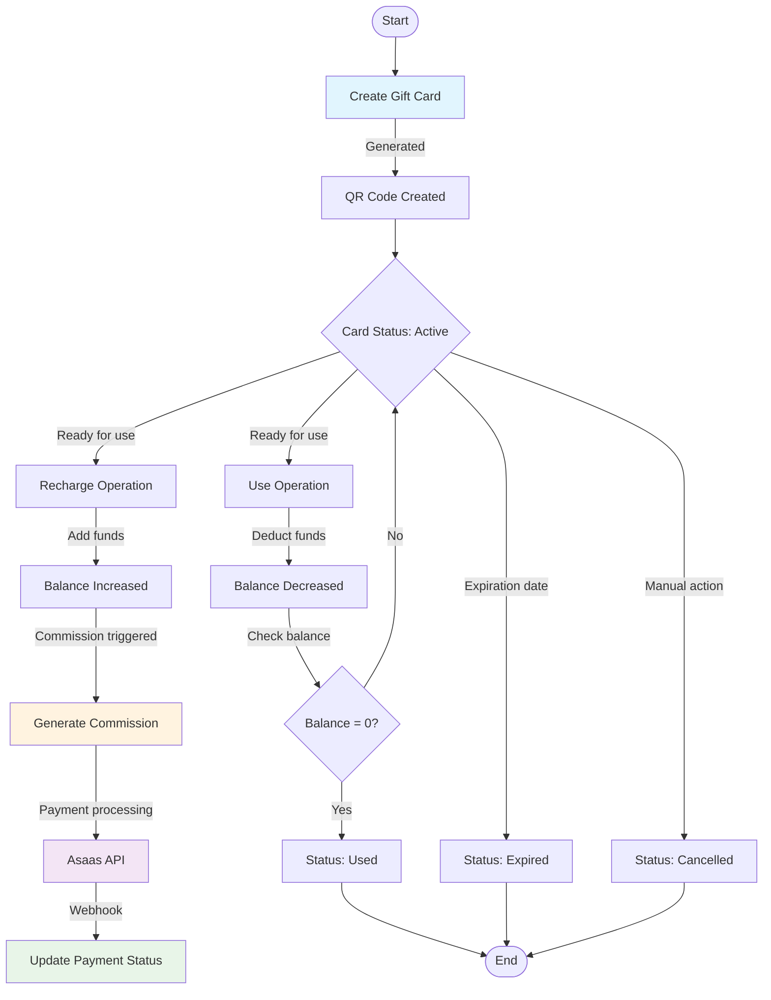

### Commission Processing Flow

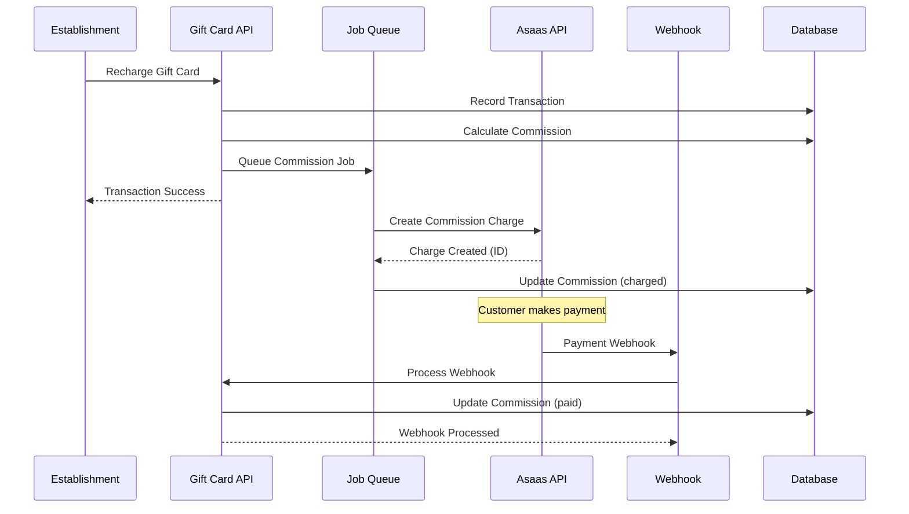

### User Authentication & Authorization Flow

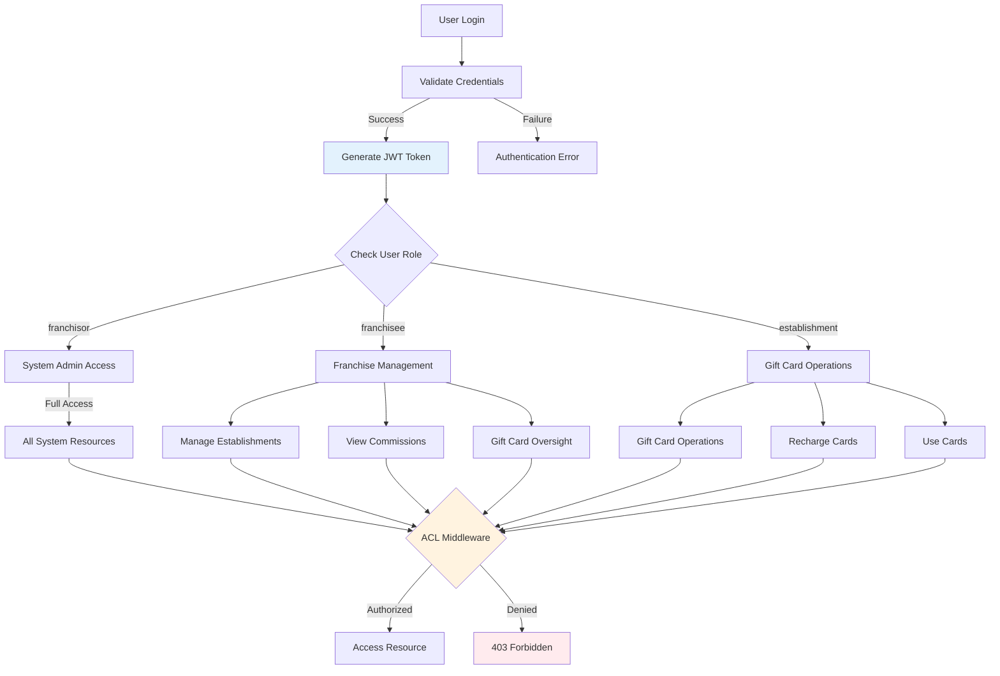

## Technical Architecture Diagrams

### Modular System Architecture

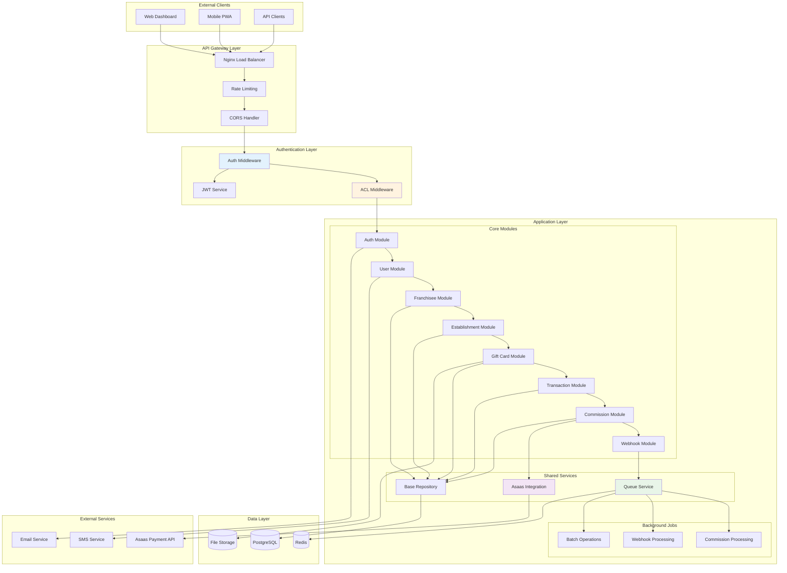

### Database Relationship Flow

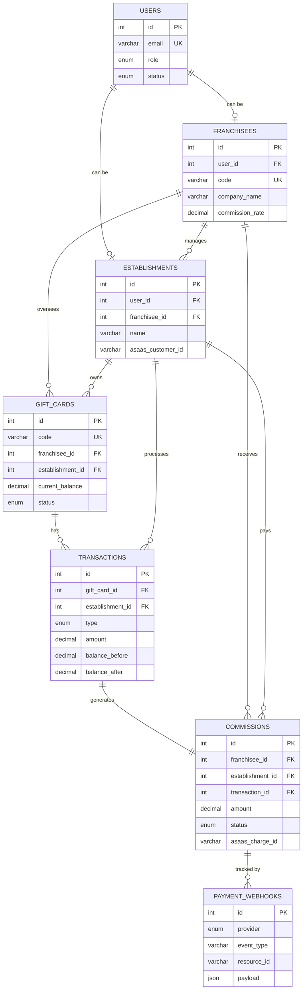

### Asaas Payment Integration Flow

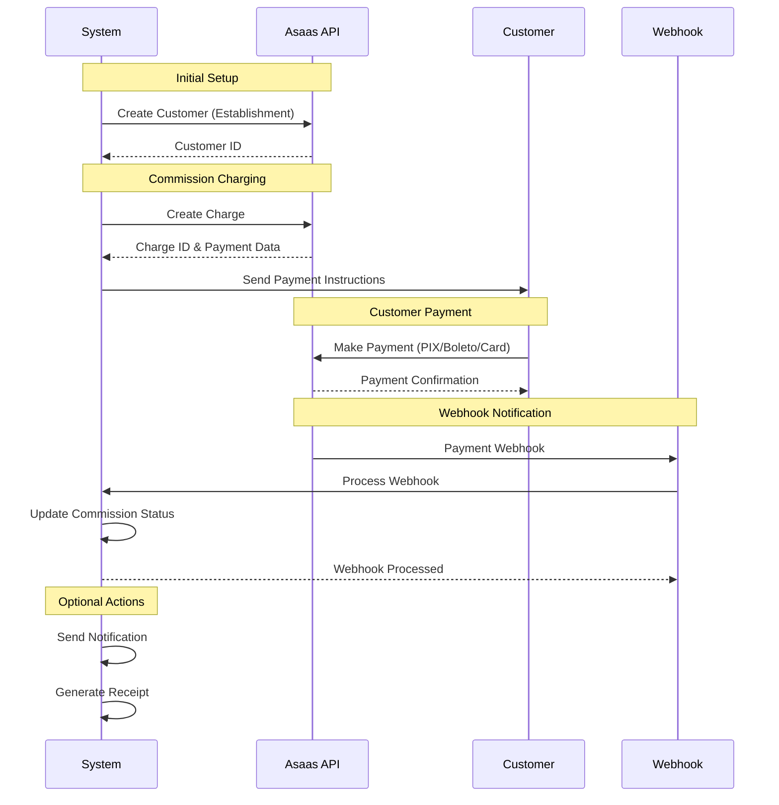

### Queue Processing Architecture

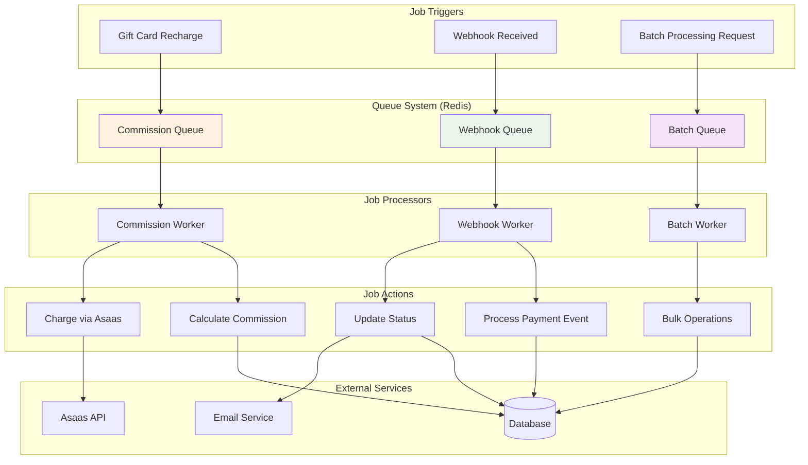

## Deployment Architecture

### Production Deployment Diagram

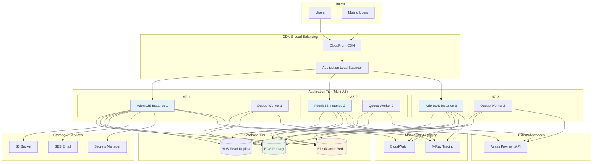

### CI/CD Pipeline Flow

```mermaid
flowchart LR
    subgraph "Development"
        DEV[Developer]
        GIT[Git Repository]
    end
    
    subgraph "CI Pipeline"
        TRIGGER[Pipeline Trigger]
        CHECKOUT[Checkout Code]
        INSTALL[Install Dependencies]
        LINT[Code Linting]
        TEST[Run Tests]
        BUILD[Build Application]
        DOCKER[Build Docker Image]
    end
    
    subgraph "CD Pipeline"
        STAGING[Deploy to Staging]
        E2E[E2E Tests]
        APPROVAL[Manual Approval]
        PRODUCTION[Deploy to Production]
        HEALTH[Health Check]
    end
    
    subgraph "Infrastructure"
        ECR[ECR Registry]
        ECS_STAGING[ECS Staging]
        ECS_PROD[ECS Production]
    end
    
    %% Development flow
    DEV --> GIT
    GIT --> TRIGGER
    
    %% CI flow
    TRIGGER --> CHECKOUT
    CHECKOUT --> INSTALL
    INSTALL --> LINT
    LINT --> TEST
    TEST --> BUILD
    BUILD --> DOCKER
    
    %% CD flow
    DOCKER --> ECR
    ECR --> STAGING
    STAGING --> ECS_STAGING
    ECS_STAGING --> E2E
    E2E --> APPROVAL
    APPROVAL --> PRODUCTION
    PRODUCTION --> ECS_PROD
    ECS_PROD --> HEALTH
    
    style LINT fill:#fff3e0
    style TEST fill:#e8f5e8
    style APPROVAL fill:#f3e5f5
    style HEALTH fill:#e3f2fd
```

## Security Architecture

### Security Layers Diagram

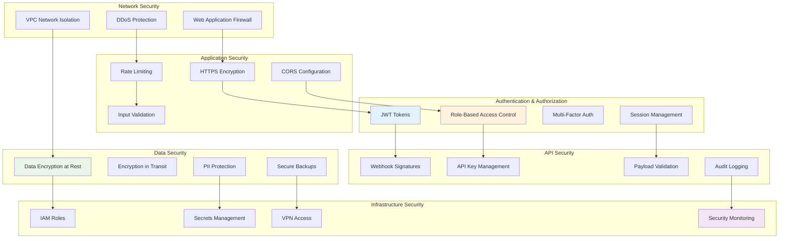

### Data Flow Security

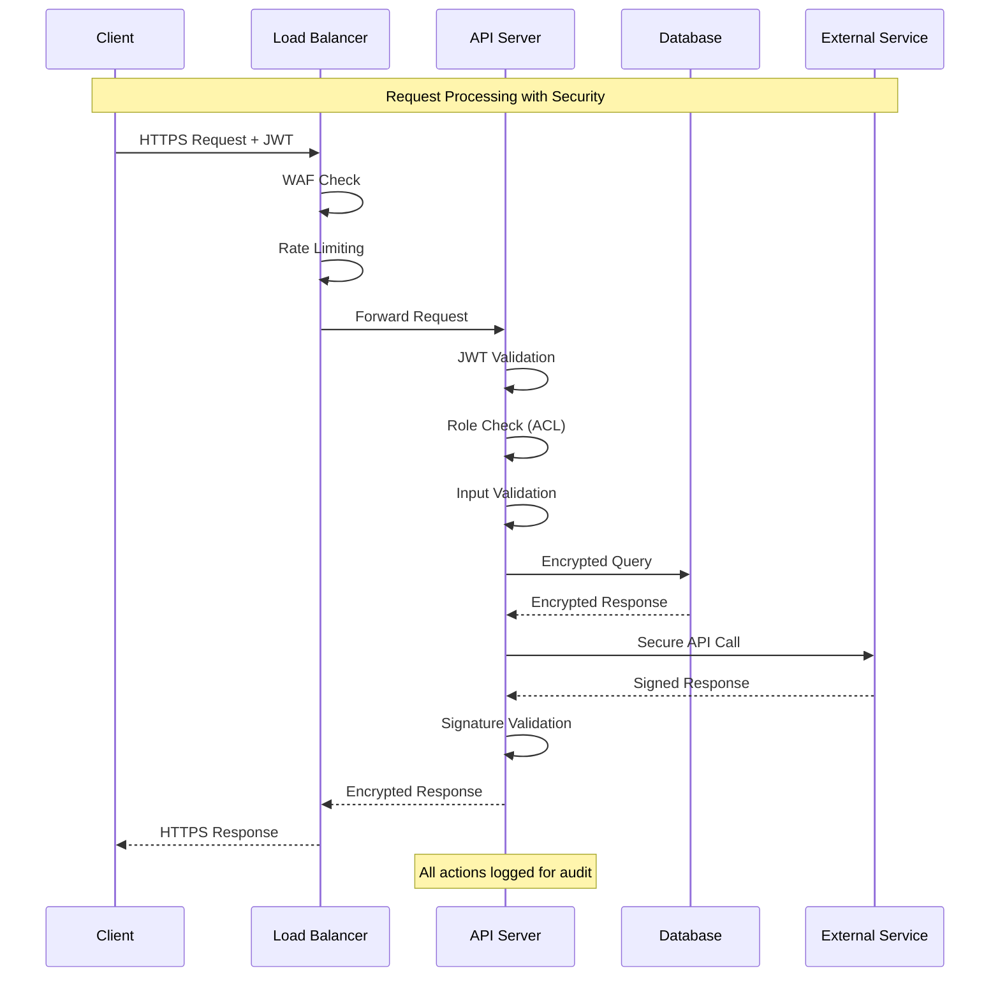

---

*These diagrams provide a comprehensive view of the gift card platform's architecture, from high-level business flows to
detailed technical implementations. Each diagram serves as a blueprint for understanding different aspects of the
system.*
