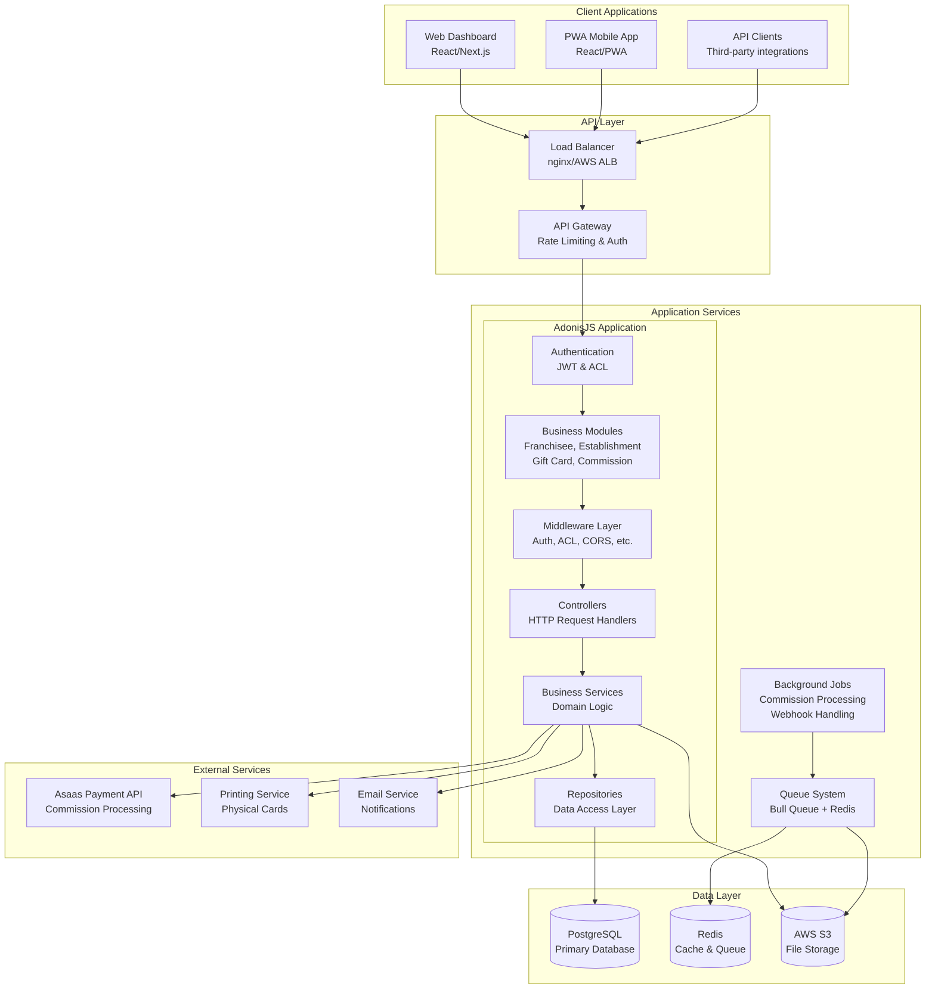
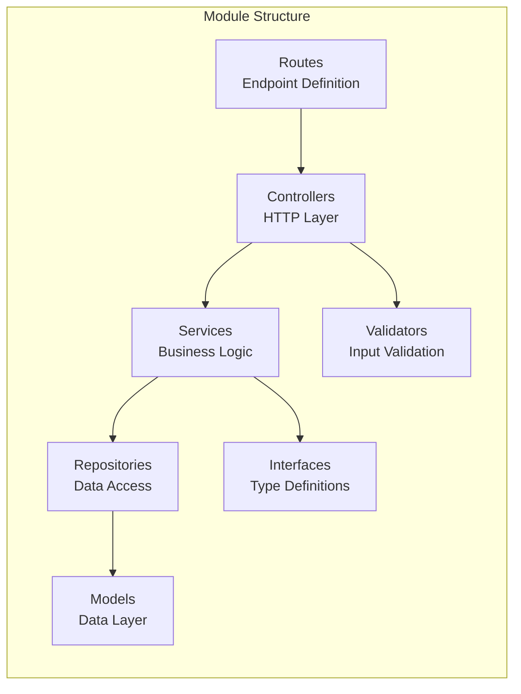
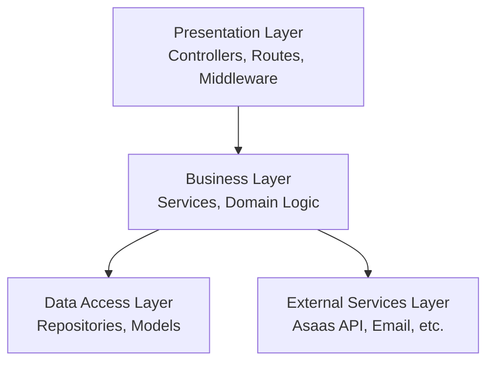
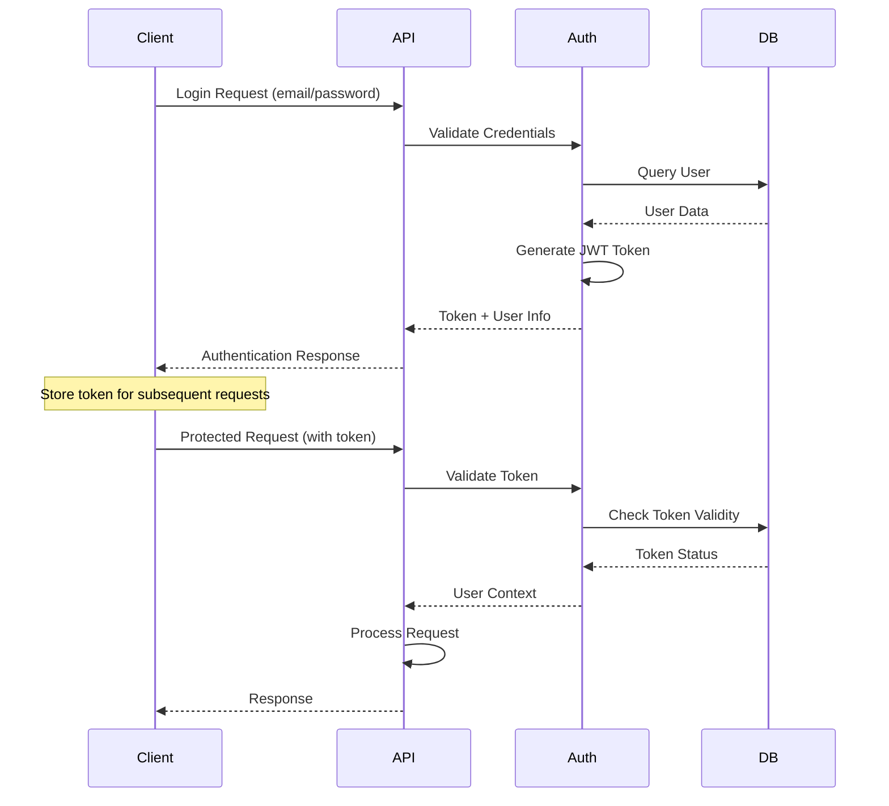
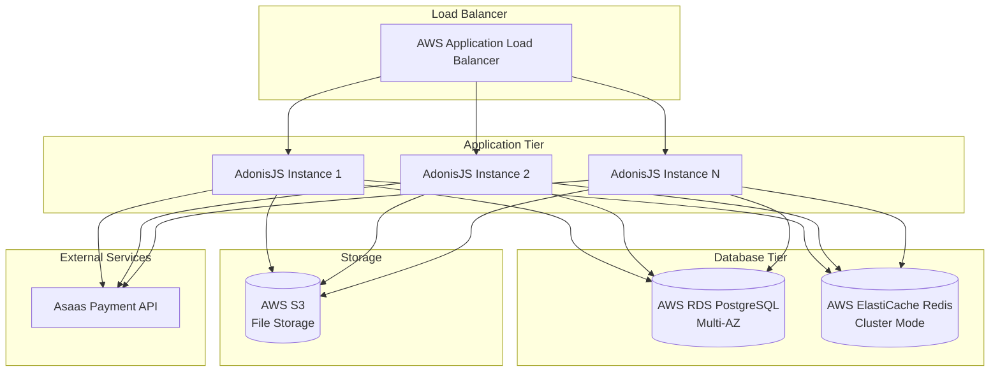
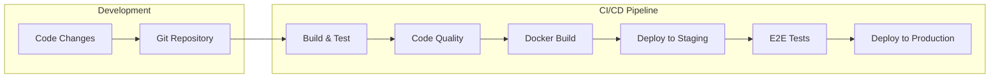

# Architecture Overview

This document provides a comprehensive overview of the gift card platform architecture, including system design,
technology stack, and architectural patterns.

## System Architecture

The gift card platform follows a modular, layered architecture built on AdonisJS v6 framework, designed for scalability,
maintainability, and performance.

### High-Level Architecture Diagram



## Technology Stack

### Backend Framework

- **AdonisJS v6**: Modern Node.js framework with TypeScript support
- **Node.js**: Runtime environment for server-side JavaScript
- **TypeScript**: Type-safe development with enhanced developer experience

### Database & Storage

- **PostgreSQL**: Primary relational database for transactional data
- **Redis**: Caching and queue management
- **AWS S3**: File storage for QR codes and documents

### Authentication & Security

- **JWT Tokens**: Stateless authentication with AdonisJS access tokens
- **ACL Middleware**: Role-based access control
- **Password Hashing**: Secure password storage with bcrypt

### Background Processing

- **Bull Queue**: Redis-based job queue for background processing
- **Job Processors**: Commission calculation, webhook processing

### External Integrations

- **Asaas API**: Payment processing and commission charging
- **QR Code Generation**: Gift card identification and scanning

### Development & Deployment

- **Docker**: Containerized deployment
- **pnpm**: Package management
- **ESLint & Prettier**: Code quality and formatting
- **Japa**: Testing framework

## Architectural Patterns

### 1. **Modular Architecture**

The application follows a module-based architecture where each business domain is encapsulated in its own module:



### 2. **Layered Architecture Pattern**



### 3. **Repository Pattern**

All data access is abstracted through repositories that implement a common interface:

```typescript
interface LucidRepositoryInterface<T> {
  find(id: number): Promise<T | null>

  create(data: Partial<T>): Promise<T>

  update(id: number, data: Partial<T>): Promise<T>

  delete(id: number): Promise<boolean>

  paginate(options: PaginationOptions): Promise<PaginatedResult<T>>
}
```

## Core Business Modules

### 1. **Authentication Module** (`app/modules/auth/`)

- User login/logout functionality
- JWT token management
- Password reset capabilities
- Role-based access control

### 2. **User Management Module** (`app/modules/user/`)

- User CRUD operations
- Role assignment and management
- Profile management
- User authentication services

### 3. **Franchisee Module** (`app/modules/franchisee/`)

- Franchisee registration and management
- Commission rate configuration
- Establishment oversight
- Performance analytics

### 4. **Establishment Module** (`app/modules/establishment/`)

- Local business registration
- Gift card management interface
- Transaction processing
- Payment method configuration

### 5. **Gift Card Module** (`app/modules/gift-card/`)

- Gift card creation with QR codes
- Balance management
- Recharge operations
- Usage tracking

### 6. **Transaction Module** (`app/modules/transaction/`)

- Transaction recording and audit
- Balance calculations
- Transaction history
- Reporting capabilities

### 7. **Commission Module** (`app/modules/commission/`)

- Automatic commission calculation
- Payment processing integration
- Status tracking
- Financial reporting

### 8. **Webhook Module** (`app/modules/webhook/`)

- External payment event processing
- Asaas webhook handling
- Event queue management
- Status synchronization

### 9. **Asaas Integration Module** (`app/modules/asaas/`)

- Payment API client
- Customer management
- Charge creation and tracking
- Webhook signature validation

## Security Architecture

### Authentication Flow



### Authorization Levels

1. **Public Routes**: No authentication required
2. **Authenticated Routes**: Valid JWT token required
3. **Role-Based Routes**: Specific role permissions required
4. **Resource-Based Routes**: Ownership/relationship validation

### Data Protection

- **Password Hashing**: bcrypt with salt
- **Token Security**: JWT with expiration and refresh capabilities
- **Input Validation**: Comprehensive validation on all inputs
- **SQL Injection Protection**: Lucid ORM parameterized queries
- **CORS Configuration**: Controlled cross-origin access

## Scalability Considerations

### Horizontal Scaling

- **Stateless Design**: JWT tokens enable stateless authentication
- **Database Connection Pooling**: Efficient database resource usage
- **Queue Processing**: Background jobs can be distributed across workers
- **Microservice Ready**: Modular design supports service extraction

### Performance Optimizations

- **Database Indexing**: Strategic indexes on frequently queried columns
- **Redis Caching**: Fast access to frequently accessed data
- **Connection Pooling**: Efficient database connections
- **Lazy Loading**: Optimized database queries with eager loading where needed

### Monitoring & Observability

- **Structured Logging**: Comprehensive application logging
- **Error Tracking**: Centralized error monitoring
- **Performance Metrics**: Request timing and database query performance
- **Health Checks**: Application and dependency health monitoring

## Deployment Architecture

### Production Environment



### CI/CD Pipeline



## Quality Assurance

### Code Quality

- **TypeScript**: Static type checking
- **ESLint**: Code linting and style enforcement
- **Prettier**: Code formatting
- **Husky**: Pre-commit hooks

### Testing Strategy

- **Unit Tests**: Service and repository layer testing
- **Integration Tests**: API endpoint testing
- **E2E Tests**: Complete user flow testing
- **Performance Tests**: Load and stress testing

### Development Workflow

- **Feature Branches**: Isolated development
- **Code Reviews**: Peer review process
- **Automated Testing**: CI/CD integration
- **Documentation**: Comprehensive technical documentation

---

*This architecture supports the current gift card platform requirements and provides a foundation for future scaling and
feature development.*
