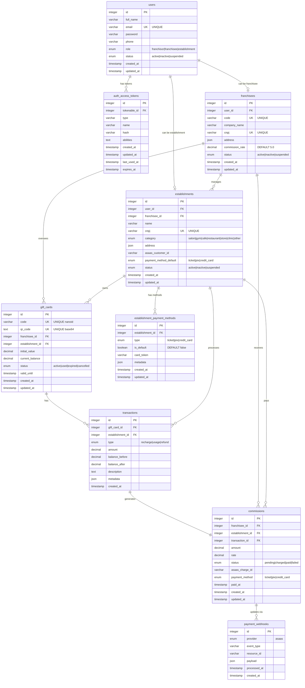

# Database Entity Relationship Diagram

This document provides a comprehensive view of the gift card platform database schema, including entity relationships,
constraints, and business logic flow.

## Database Overview

The database is built on PostgreSQL and follows a hierarchical structure that supports the gift card platform's business
model:

- **User Management**: Role-based authentication system
- **Franchise Hierarchy**: Franchisor → Franchisee → Establishment relationship
- **Gift Card Lifecycle**: Creation, recharge, usage, and commission tracking
- **Payment Integration**: Commission processing through Asaas API

## Entity Relationship Diagram



## Table Specifications

### Core Entity Tables

#### 1. **users** - Authentication and User Management

- **Purpose**: Central user authentication with role-based access
- **Key Features**:
  - Three-tier role system (franchisor/franchisee/establishment)
  - Status management for user lifecycle
  - Unique email constraint for authentication

#### 2. **franchisees** - Franchise Owner Management

- **Purpose**: Manages franchise owners who oversee establishments
- **Key Features**:
  - Unique business code and CNPJ
  - Configurable commission rates
  - JSON address storage for flexibility
  - Direct relationship to user account

#### 3. **establishments** - Local Business Management

- **Purpose**: Represents local businesses that use gift cards
- **Key Features**:
  - Categorized business types
  - Asaas customer integration for payments
  - Default payment method preferences
  - Belongs to both user and franchisee

### Gift Card Lifecycle Tables

#### 4. **gift_cards** - Gift Card Management

- **Purpose**: Core gift card entity with balance tracking
- **Key Features**:
  - Unique nanoid codes for identification
  - Base64 encoded QR codes for scanning
  - Real-time balance tracking
  - Expiration date support
  - Status lifecycle management

#### 5. **transactions** - Transaction Audit Trail

- **Purpose**: Complete audit trail of all gift card activities
- **Key Features**:
  - Before/after balance tracking
  - Multiple transaction types (recharge/usage/refund)
  - Metadata storage for additional context
  - Immutable transaction records

### Financial Management Tables

#### 6. **commissions** - Commission Tracking

- **Purpose**: Manages commission payments to franchisees
- **Key Features**:
  - Automatic commission calculation
  - Asaas payment integration
  - Status tracking through payment lifecycle
  - Multiple payment method support

#### 7. **payment_webhooks** - Payment Event Processing

- **Purpose**: Handles external payment system events
- **Key Features**:
  - Provider-agnostic design
  - Complete payload storage
  - Processing status tracking
  - Event type categorization

### Configuration Tables

#### 8. **establishment_payment_methods** - Payment Preferences

- **Purpose**: Manages payment method preferences per establishment
- **Key Features**:
  - Multiple payment methods per establishment
  - Default method selection
  - Tokenized card storage
  - Metadata for payment-specific configurations

## Key Relationships and Business Logic

### 1. **User Role Hierarchy**

```
Franchisor (System Admin)
    ↓
Franchisee (Franchise Owner)
    ↓
Establishment (Local Business)
```

### 2. **Gift Card Flow**

```
Creation → Recharge → Usage → Commission Generation
    ↓         ↓        ↓            ↓
Status    Transaction  Transaction  Payment Processing
Update    Recording    Recording    (via Asaas)
```

### 3. **Commission Processing Flow**

```
Transaction Occurs
    ↓
Commission Calculated (franchisee.commission_rate)
    ↓
Commission Status: pending
    ↓
Asaas Charge Created
    ↓
Commission Status: charged
    ↓
Webhook Received (payment confirmed)
    ↓
Commission Status: paid
```

## Database Constraints and Indexes

### Foreign Key Constraints

- **CASCADE DELETE**: `auth_access_tokens`, `establishment_payment_methods`
- **RESTRICT DELETE**: Core business entities to maintain data integrity

### Performance Indexes

- **Primary Operations**: gift card lookups, transaction queries, commission tracking
- **Composite Indexes**: webhook processing, payment method selection
- **Unique Constraints**: business identifiers (CNPJ, codes, emails)

### Data Integrity Features

- **ENUM Constraints**: Standardized status values and categories
- **Unique Constraints**: Business-critical uniqueness (emails, CNPJs, gift card codes)
- **JSON Validation**: Structured data storage with schema flexibility

## Migration History

All database changes are managed through AdonisJS migrations located in `database/migrations/`:

1. `1748713513696_create_users_table.ts` - Core user authentication
2. `1748713513697_create_access_tokens_table.ts` - JWT token management
3. `1748715024828_create_franchisees_table.ts` - Franchise management
4. `1748715025463_create_establishments_table.ts` - Establishment management
5. `1748715026164_create_gift_cards_table.ts` - Gift card system
6. `1748715026890_create_transactions_table.ts` - Transaction tracking
7. `1748715027497_create_commissions_table.ts` - Commission processing
8. `1748715028147_create_payment_webhooks_table.ts` - Webhook handling
9. `1748715028880_create_establishment_payment_methods_table.ts` - Payment methods

## Security Considerations

- **Password Hashing**: All user passwords are hashed using AdonisJS hash provider
- **Token Management**: JWT tokens with expiration and last-used tracking
- **Business Data Protection**: RESTRICT DELETE on core business entities
- **Payment Security**: Tokenized card storage, webhook signature validation
- **LGPD Compliance**: User data protection with proper access controls

---

*This ERD represents the current production schema. All changes should be made through migrations to maintain data
consistency.*
