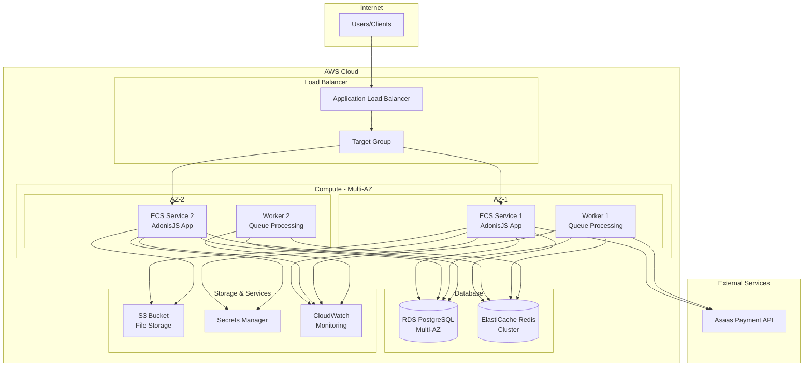

# Deployment Guide

This guide provides comprehensive instructions for deploying the gift card platform to production environments,
including infrastructure setup, CI/CD configuration, and operational procedures.

## Infrastructure Overview

### Production Architecture



## Prerequisites

### Development Tools

- **Node.js**: v18+ LTS
- **pnpm**: Latest version
- **Docker**: v20+ with Docker Compose
- **AWS CLI**: v2+ configured with appropriate credentials
- **Git**: Latest version

### AWS Resources Required

- **VPC**: With public and private subnets across multiple AZs
- **ECR**: Container registry for Docker images
- **ECS**: Container orchestration service
- **RDS**: PostgreSQL database (Multi-AZ for production)
- **ElastiCache**: Redis cluster for caching and queues
- **ALB**: Application Load Balancer
- **S3**: Object storage bucket
- **Secrets Manager**: For sensitive configuration
- **CloudWatch**: For monitoring and logging
- **IAM**: Roles and policies for service access

## Environment Configuration

### Environment Variables

#### Required Production Variables

```bash
# Application
NODE_ENV=production
PORT=3333
HOST=0.0.0.0
LOG_LEVEL=info

# Security
APP_KEY=base64:your-256-bit-secret-key-here
JWT_SECRET=your-jwt-secret-key-here
SESSION_SECRET=your-session-secret-here

# Database
DB_CONNECTION=pg
DB_HOST=your-rds-endpoint.region.rds.amazonaws.com
DB_PORT=5432
DB_USER=giftcard_user
DB_PASSWORD=your-secure-password
DB_DATABASE=giftcard_production

# Redis
REDIS_CONNECTION=redis
REDIS_HOST=your-elasticache-endpoint.cache.amazonaws.com
REDIS_PORT=6379
REDIS_PASSWORD=your-redis-password

# Payment Integration
ASAAS_API_KEY=your-production-asaas-api-key
ASAAS_ENVIRONMENT=production
ASAAS_WEBHOOK_SECRET=your-webhook-secret

# Storage
S3_BUCKET=your-production-bucket
S3_REGION=us-east-1
AWS_ACCESS_KEY_ID=your-access-key
AWS_SECRET_ACCESS_KEY=your-secret-key

# Monitoring
SENTRY_DSN=your-sentry-dsn
NEW_RELIC_LICENSE_KEY=your-newrelic-key
```

#### AWS Secrets Manager Configuration

```json
{
  "DB_PASSWORD": "your-secure-database-password",
  "JWT_SECRET": "your-jwt-secret-key",
  "ASAAS_API_KEY": "your-production-asaas-key",
  "ASAAS_WEBHOOK_SECRET": "your-webhook-secret",
  "AWS_SECRET_ACCESS_KEY": "your-aws-secret-key"
}
```

## Docker Configuration

### Production Dockerfile

```dockerfile
# Multi-stage build for production optimization
FROM node:18-alpine AS base
WORKDIR /app
COPY package.json pnpm-lock.yaml ./
RUN npm install -g pnpm

FROM base AS dependencies
RUN pnpm install --frozen-lockfile --production=false

FROM base AS build
COPY --from=dependencies /app/node_modules ./node_modules
COPY . .
RUN pnpm build

FROM base AS production
RUN pnpm install --frozen-lockfile --production=true && pnpm store prune
COPY --from=build /app/build ./build
COPY --from=build /app/package.json ./

# Create non-root user for security
RUN addgroup -g 1001 -S nodejs
RUN adduser -S adonisjs -u 1001
USER adonisjs

EXPOSE 3333
CMD ["node", "build/bin/server.js"]
```

### Docker Compose for Local Development

```yaml
# docker-compose.yml
version: '3.8'

services:
  app:
    build: .
    ports:
      - "3333:3333"
    environment:
      - NODE_ENV=development
      - DB_HOST=postgres
      - REDIS_HOST=redis
    depends_on:
      - postgres
      - redis
    volumes:
      - .:/app
      - /app/node_modules

  postgres:
    image: postgres:15-alpine
    environment:
      POSTGRES_DB: giftcard_dev
      POSTGRES_USER: giftcard_user
      POSTGRES_PASSWORD: development_password
    ports:
      - "5432:5432"
    volumes:
      - postgres_data:/var/lib/postgresql/data

  redis:
    image: redis:7-alpine
    ports:
      - "6379:6379"
    volumes:
      - redis_data:/data

  worker:
    build: .
    command: node ace queue:work
    environment:
      - NODE_ENV=development
      - DB_HOST=postgres
      - REDIS_HOST=redis
    depends_on:
      - postgres
      - redis
      - app

volumes:
  postgres_data:
  redis_data:
```

## AWS Infrastructure Setup

### Terraform Configuration

#### Main Infrastructure

```hcl
# main.tf
provider "aws" {
  region = var.aws_region
}

# VPC Configuration
module "vpc" {
  source = "terraform-aws-modules/vpc/aws"
  
  name = "giftcard-vpc"
  cidr = "10.0.0.0/16"
  
  azs             = ["${var.aws_region}a", "${var.aws_region}b"]
  private_subnets = ["10.0.1.0/24", "10.0.2.0/24"]
  public_subnets  = ["10.0.101.0/24", "10.0.102.0/24"]
  
  enable_nat_gateway = true
  enable_vpn_gateway = false
  
  tags = {
    Environment = var.environment
    Application = "giftcard-platform"
  }
}

# ECS Cluster
resource "aws_ecs_cluster" "main" {
  name = "giftcard-cluster"
  
  setting {
    name  = "containerInsights"
    value = "enabled"
  }
}

# Application Load Balancer
resource "aws_lb" "main" {
  name               = "giftcard-alb"
  internal           = false
  load_balancer_type = "application"
  security_groups    = [aws_security_group.alb.id]
  subnets           = module.vpc.public_subnets
  
  enable_deletion_protection = true
}

# RDS PostgreSQL
resource "aws_db_instance" "main" {
  identifier = "giftcard-postgres"
  
  engine            = "postgres"
  engine_version    = "15.4"
  instance_class    = "db.t3.medium"
  allocated_storage = 100
  max_allocated_storage = 1000
  
  db_name  = "giftcard_production"
  username = "giftcard_user"
  password = var.db_password
  
  vpc_security_group_ids = [aws_security_group.rds.id]
  db_subnet_group_name   = aws_db_subnet_group.main.name
  
  backup_retention_period = 7
  backup_window          = "03:00-04:00"
  maintenance_window     = "sun:04:00-sun:05:00"
  
  multi_az = true
  
  skip_final_snapshot = false
  final_snapshot_identifier = "giftcard-final-snapshot"
  
  tags = {
    Environment = var.environment
  }
}

# ElastiCache Redis
resource "aws_elasticache_subnet_group" "main" {
  name       = "giftcard-cache-subnet"
  subnet_ids = module.vpc.private_subnets
}

resource "aws_elasticache_replication_group" "main" {
  replication_group_id         = "giftcard-redis"
  description                  = "Redis cluster for gift card platform"
  
  node_type            = "cache.t3.micro"
  port                 = 6379
  parameter_group_name = "default.redis7"
  
  num_cache_clusters = 2
  
  subnet_group_name  = aws_elasticache_subnet_group.main.name
  security_group_ids = [aws_security_group.redis.id]
  
  at_rest_encryption_enabled = true
  transit_encryption_enabled = true
}
```

#### ECS Service Configuration

```hcl
# ecs.tf
resource "aws_ecs_task_definition" "app" {
  family                   = "giftcard-app"
  requires_compatibilities = ["FARGATE"]
  network_mode            = "awsvpc"
  cpu                     = 512
  memory                  = 1024
  execution_role_arn      = aws_iam_role.ecs_execution.arn
  task_role_arn          = aws_iam_role.ecs_task.arn
  
  container_definitions = jsonencode([
    {
      name  = "giftcard-app"
      image = "${aws_ecr_repository.main.repository_url}:latest"
      
      portMappings = [
        {
          containerPort = 3333
          hostPort      = 3333
        }
      ]
      
      environment = [
        {
          name  = "NODE_ENV"
          value = "production"
        },
        {
          name  = "PORT"
          value = "3333"
        }
      ]
      
      secrets = [
        {
          name      = "DB_PASSWORD"
          valueFrom = aws_secretsmanager_secret.main.arn
        }
      ]
      
      logConfiguration = {
        logDriver = "awslogs"
        options = {
          awslogs-group         = aws_cloudwatch_log_group.app.name
          awslogs-region        = var.aws_region
          awslogs-stream-prefix = "ecs"
        }
      }
    }
  ])
}

resource "aws_ecs_service" "app" {
  name            = "giftcard-app"
  cluster         = aws_ecs_cluster.main.id
  task_definition = aws_ecs_task_definition.app.arn
  desired_count   = 2
  launch_type     = "FARGATE"
  
  network_configuration {
    subnets         = module.vpc.private_subnets
    security_groups = [aws_security_group.ecs.id]
  }
  
  load_balancer {
    target_group_arn = aws_lb_target_group.app.arn
    container_name   = "giftcard-app"
    container_port   = 3333
  }
  
  depends_on = [aws_lb_listener.app]
}
```

## CI/CD Pipeline

### GitHub Actions Workflow

```yaml
# .github/workflows/deploy.yml
name: Deploy to Production

on:
  push:
    branches: [main]
  pull_request:
    branches: [main]

env:
  AWS_REGION: us-east-1
  ECR_REPOSITORY: giftcard-platform

jobs:
  test:
    runs-on: ubuntu-latest
    
    services:
      postgres:
        image: postgres:15
        env:
          POSTGRES_PASSWORD: postgres
          POSTGRES_DB: test_db
        options: >-
          --health-cmd pg_isready
          --health-interval 10s
          --health-timeout 5s
          --health-retries 5
      
      redis:
        image: redis:7
        options: >-
          --health-cmd "redis-cli ping"
          --health-interval 10s
          --health-timeout 5s
          --health-retries 5
    
    steps:
      - name: Checkout code
        uses: actions/checkout@v4
      
      - name: Setup Node.js
        uses: actions/setup-node@v4
        with:
          node-version: '18'
          cache: 'pnpm'
      
      - name: Install pnpm
        run: npm install -g pnpm
      
      - name: Install dependencies
        run: pnpm install --frozen-lockfile
      
      - name: Run linting
        run: pnpm lint
      
      - name: Run type checking
        run: pnpm typecheck
      
      - name: Run tests
        run: pnpm test
        env:
          DB_CONNECTION: pg
          DB_HOST: localhost
          DB_PORT: 5432
          DB_USER: postgres
          DB_PASSWORD: postgres
          DB_DATABASE: test_db
          REDIS_HOST: localhost
          REDIS_PORT: 6379

  build-and-deploy:
    needs: test
    runs-on: ubuntu-latest
    if: github.ref == 'refs/heads/main'
    
    steps:
      - name: Checkout code
        uses: actions/checkout@v4
      
      - name: Configure AWS credentials
        uses: aws-actions/configure-aws-credentials@v4
        with:
          aws-access-key-id: ${{ secrets.AWS_ACCESS_KEY_ID }}
          aws-secret-access-key: ${{ secrets.AWS_SECRET_ACCESS_KEY }}
          aws-region: ${{ env.AWS_REGION }}
      
      - name: Login to Amazon ECR
        id: login-ecr
        uses: aws-actions/amazon-ecr-login@v2
      
      - name: Build, tag, and push image to Amazon ECR
        env:
          ECR_REGISTRY: ${{ steps.login-ecr.outputs.registry }}
          IMAGE_TAG: ${{ github.sha }}
        run: |
          docker build -t $ECR_REGISTRY/$ECR_REPOSITORY:$IMAGE_TAG .
          docker tag $ECR_REGISTRY/$ECR_REPOSITORY:$IMAGE_TAG $ECR_REGISTRY/$ECR_REPOSITORY:latest
          docker push $ECR_REGISTRY/$ECR_REPOSITORY:$IMAGE_TAG
          docker push $ECR_REGISTRY/$ECR_REPOSITORY:latest
      
      - name: Update ECS service
        run: |
          aws ecs update-service \
            --cluster giftcard-cluster \
            --service giftcard-app \
            --force-new-deployment
      
      - name: Wait for deployment to complete
        run: |
          aws ecs wait services-stable \
            --cluster giftcard-cluster \
            --services giftcard-app
```

### Deployment Scripts

#### Database Migration Script

```bash
#!/bin/bash
# scripts/migrate.sh

set -e

echo "Starting database migration..."

# Run migrations
node ace migration:run --force

echo "Running database seeders for production data..."
node ace db:seed --files="database/seeders/ProductionSeeder.ts"

echo "Database migration completed successfully!"
```

#### Health Check Script

```bash
#!/bin/bash
# scripts/health-check.sh

HEALTH_URL="https://api.yourdomain.com/health"
MAX_ATTEMPTS=30
ATTEMPT=1

echo "Checking application health..."

while [ $ATTEMPT -le $MAX_ATTEMPTS ]; do
  HTTP_STATUS=$(curl -s -o /dev/null -w "%{http_code}" $HEALTH_URL)
  
  if [ $HTTP_STATUS -eq 200 ]; then
    echo "Application is healthy!"
    exit 0
  fi
  
  echo "Attempt $ATTEMPT/$MAX_ATTEMPTS: HTTP $HTTP_STATUS"
  sleep 10
  ATTEMPT=$((ATTEMPT + 1))
done

echo "Application health check failed!"
exit 1
```

## Production Deployment Process

### Step 1: Infrastructure Provisioning

```bash
# Clone infrastructure repository
git clone https://github.com/yourorg/giftcard-infrastructure.git
cd giftcard-infrastructure

# Initialize Terraform
terraform init

# Plan infrastructure changes
terraform plan -var-file="production.tfvars"

# Apply infrastructure
terraform apply -var-file="production.tfvars"
```

### Step 2: Application Deployment

```bash
# Build and push Docker image
docker build -t giftcard-platform:latest .
docker tag giftcard-platform:latest your-ecr-repo:latest
docker push your-ecr-repo:latest

# Deploy to ECS
aws ecs update-service \
  --cluster giftcard-cluster \
  --service giftcard-app \
  --force-new-deployment

# Wait for deployment
aws ecs wait services-stable \
  --cluster giftcard-cluster \
  --services giftcard-app
```

### Step 3: Database Setup

```bash
# Run migrations (first deployment only)
kubectl run migration-job --image=your-ecr-repo:latest \
  --command -- node ace migration:run --force

# Verify database schema
node ace migration:status
```

### Step 4: Configuration Verification

```bash
# Verify environment variables
aws secretsmanager get-secret-value --secret-id giftcard-secrets

# Test API health
curl https://api.yourdomain.com/health

# Test authentication
curl -X POST https://api.yourdomain.com/api/v1/auth/login \
  -H "Content-Type: application/json" \
  -d '{"email":"test@example.com","password":"password"}'
```

## Monitoring and Observability

### CloudWatch Configuration

#### Custom Metrics

```typescript
// Custom CloudWatch metrics
class MetricsService {
  private cloudWatch = new AWS.CloudWatch()
  
  async recordApiMetric(metricName: string, value: number, unit: string = 'Count') {
    await this.cloudWatch.putMetricData({
      Namespace: 'GiftCard/API',
      MetricData: [{
        MetricName: metricName,
        Value: value,
        Unit: unit,
        Timestamp: new Date()
      }]
    }).promise()
  }
  
  async recordBusinessMetric(metricName: string, value: number) {
    await this.cloudWatch.putMetricData({
      Namespace: 'GiftCard/Business',
      MetricData: [{
        MetricName: metricName,
        Value: value,
        Unit: 'Count',
        Timestamp: new Date()
      }]
    }).promise()
  }
}
```

#### CloudWatch Alarms

```hcl
# CloudWatch alarms for monitoring
resource "aws_cloudwatch_metric_alarm" "high_cpu" {
  alarm_name          = "giftcard-high-cpu"
  comparison_operator = "GreaterThanThreshold"
  evaluation_periods  = "2"
  metric_name         = "CPUUtilization"
  namespace           = "AWS/ECS"
  period              = "120"
  statistic           = "Average"
  threshold           = "80"
  alarm_description   = "This metric monitors ECS CPU utilization"
  alarm_actions       = [aws_sns_topic.alerts.arn]
  
  dimensions = {
    ServiceName = aws_ecs_service.app.name
    ClusterName = aws_ecs_cluster.main.name
  }
}

resource "aws_cloudwatch_metric_alarm" "database_connections" {
  alarm_name          = "giftcard-db-connections"
  comparison_operator = "GreaterThanThreshold"
  evaluation_periods  = "2"
  metric_name         = "DatabaseConnections"
  namespace           = "AWS/RDS"
  period              = "300"
  statistic           = "Average"
  threshold           = "80"
  alarm_description   = "This metric monitors RDS connections"
  alarm_actions       = [aws_sns_topic.alerts.arn]
  
  dimensions = {
    DBInstanceIdentifier = aws_db_instance.main.id
  }
}
```

## Backup and Recovery

### Database Backup Strategy

#### Automated Backups

```bash
# Daily backup script
#!/bin/bash
# scripts/backup.sh

TIMESTAMP=$(date +%Y%m%d_%H%M%S)
BACKUP_FILE="giftcard_backup_$TIMESTAMP.sql"
S3_BUCKET="your-backup-bucket"

# Create database dump
pg_dump $DATABASE_URL > $BACKUP_FILE

# Encrypt backup
gpg --cipher-algo AES256 --compress-algo 1 --s2k-mode 3 \
    --s2k-digest-algo SHA512 --s2k-count 65536 \
    --symmetric --output $BACKUP_FILE.gpg $BACKUP_FILE

# Upload to S3
aws s3 cp $BACKUP_FILE.gpg s3://$S3_BUCKET/database/

# Cleanup local files
rm $BACKUP_FILE $BACKUP_FILE.gpg

echo "Backup completed: $BACKUP_FILE.gpg"
```

#### Recovery Procedures

```bash
# Database recovery script
#!/bin/bash
# scripts/restore.sh

BACKUP_FILE=$1
DATABASE_URL=$2

if [ -z "$BACKUP_FILE" ] || [ -z "$DATABASE_URL" ]; then
  echo "Usage: $0 <backup_file> <database_url>"
  exit 1
fi

# Download backup from S3
aws s3 cp s3://your-backup-bucket/database/$BACKUP_FILE.gpg ./

# Decrypt backup
gpg --decrypt $BACKUP_FILE.gpg > $BACKUP_FILE

# Restore database
psql $DATABASE_URL < $BACKUP_FILE

echo "Database restored from $BACKUP_FILE"
```

## Scaling Configuration

### Auto Scaling Setup

#### ECS Auto Scaling

```hcl
resource "aws_appautoscaling_target" "ecs_target" {
  max_capacity       = 10
  min_capacity       = 2
  resource_id        = "service/${aws_ecs_cluster.main.name}/${aws_ecs_service.app.name}"
  scalable_dimension = "ecs:service:DesiredCount"
  service_namespace  = "ecs"
}

resource "aws_appautoscaling_policy" "scale_up" {
  name               = "giftcard-scale-up"
  policy_type        = "TargetTrackingScaling"
  resource_id        = aws_appautoscaling_target.ecs_target.resource_id
  scalable_dimension = aws_appautoscaling_target.ecs_target.scalable_dimension
  service_namespace  = aws_appautoscaling_target.ecs_target.service_namespace
  
  target_tracking_scaling_policy_configuration {
    predefined_metric_specification {
      predefined_metric_type = "ECSServiceAverageCPUUtilization"
    }
    target_value = 70.0
  }
}
```

## Security Checklist

### Pre-Deployment Security

- [ ] Environment variables secured in AWS Secrets Manager
- [ ] Database encryption enabled
- [ ] SSL/TLS certificates configured
- [ ] Security groups properly configured
- [ ] IAM roles follow least privilege principle
- [ ] Webhook signatures enabled
- [ ] Rate limiting configured
- [ ] Audit logging enabled

### Post-Deployment Verification

- [ ] HTTPS enforcement working
- [ ] Database connections encrypted
- [ ] Authentication endpoints secure
- [ ] API rate limiting active
- [ ] Monitoring and alerting functional
- [ ] Backup procedures tested
- [ ] Disaster recovery plan validated

## Troubleshooting

### Common Deployment Issues

#### ECS Service Not Starting

```bash
# Check ECS service events
aws ecs describe-services \
  --cluster giftcard-cluster \
  --services giftcard-app

# Check CloudWatch logs
aws logs tail /ecs/giftcard-app --follow
```

#### Database Connection Issues

```bash
# Test database connectivity
psql -h your-rds-endpoint.region.rds.amazonaws.com \
     -U giftcard_user \
     -d giftcard_production \
     -c "SELECT version();"

# Check security group rules
aws ec2 describe-security-groups --group-ids sg-xxxxxxxx
```

#### Performance Issues

```bash
# Monitor resource utilization
aws cloudwatch get-metric-statistics \
  --namespace AWS/ECS \
  --metric-name CPUUtilization \
  --start-time 2025-01-01T00:00:00Z \
  --end-time 2025-01-01T23:59:59Z \
  --period 3600 \
  --statistics Average
```

---

*This deployment guide provides a comprehensive approach to production deployment. Regular updates and testing of
deployment procedures are essential for maintaining system reliability.*
