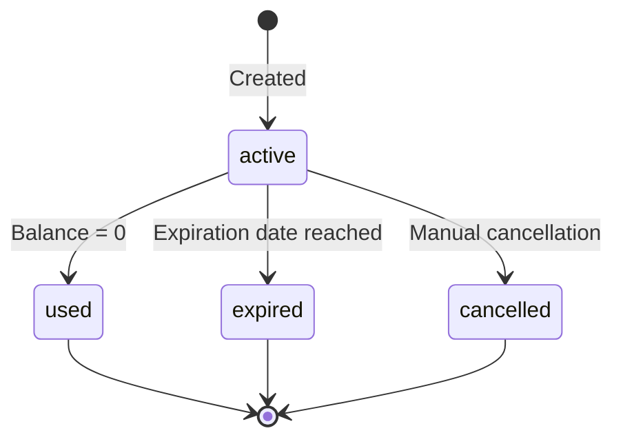
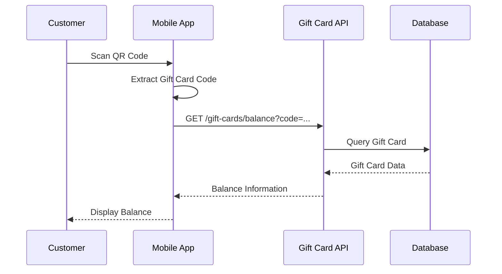

# Gift Card Module Documentation

The Gift Card module is the core of the platform, managing the entire lifecycle of gift cards from creation to usage. It
handles QR code generation, balance management, transaction recording, and commission generation.

## Module Overview

**Location**: `app/modules/gift-card/`  
**Status**: ✅ **Fully Implemented**  
**Database Table**: `gift_cards`  
**Public Access**: Balance checking (no authentication required)

## Architecture

### Module Structure

```
app/modules/gift-card/
├── controllers/
│   └── gift-cards.controller.ts      # HTTP request handlers
├── interfaces/
│   └── gift-card.interface.ts        # TypeScript interfaces
├── models/
│   └── gift_card.ts                  # Database model
├── repositories/
│   └── gift-cards.repository.ts      # Data access layer
├── routes/
│   └── index.ts                      # Route definitions
├── services/
│   ├── create-gift-card/            # Creation service
│   ├── recharge-gift-card/          # Recharge service
│   └── use-gift-card/               # Usage service
└── validators/
    └── gift-cards.validator.ts       # Request validation
```

## Core Features

### 1. Gift Card Creation

- **Unique Code Generation**: Uses nanoid for collision-resistant codes
- **QR Code Generation**: Base64-encoded QR codes for mobile scanning
- **Batch Creation**: Support for creating multiple cards in one operation
- **Expiration Management**: Optional expiration dates

### 2. Balance Management

- **Real-time Balance Tracking**: Immediate balance updates
- **Transaction History**: Complete audit trail of all operations
- **Balance Validation**: Prevents overdrafts and invalid operations

### 3. Public Balance Inquiry

- **No Authentication Required**: Anyone can check balance with card code
- **Secure Code Lookup**: No sensitive information exposed in public API

## Database Schema

### Gift Card Model

```typescript
// app/modules/gift-card/models/gift_card.ts
class GiftCard extends BaseModel {
  @column({isPrimary: true})
  public id: number

  @column()
  public code: string // Unique 21-character nanoid

  @column()
  public qrCode: string // Base64-encoded QR code image

  @column()
  public franchiseeId: number

  @column()
  public establishmentId: number

  @column()
  public initialValue: number // Original card value

  @column()
  public currentBalance: number // Current available balance

  @column()
  public status: 'active' | 'used' | 'expired' | 'cancelled'

  @column.dateTime()
  public validUntil: DateTime // Expiration date

  // Relationships
  @belongsTo(() => Franchisee)
  public franchisee: BelongsTo<typeof Franchisee>

  @belongsTo(() => Establishment)
  public establishment: BelongsTo<typeof Establishment>

  @hasMany(() => Transaction)
  public transactions: HasMany<typeof Transaction>
}
```

### Gift Card Status Lifecycle



## API Endpoints

### Public Endpoints

#### Check Gift Card Balance

```http
GET /api/v1/gift-cards/balance?code=GC-ABCD-EFGH-IJKL-MNOP
```

**Authentication**: None  
**Response Example**:

```json
{
  "code": "GC-ABCD-EFGH-IJKL-MNOP",
  "currentBalance": 150.00,
  "initialValue": 200.00,
  "status": "active",
  "validUntil": "2025-12-31T23:59:59.000Z",
  "establishment": {
    "name": "Salon ABC",
    "category": "salon"
  }
}
```

### Protected Endpoints

#### Create Single Gift Card

```http
POST /api/v1/gift-cards
```

**Request Body**:

```json
{
  "franchiseeId": 1,
  "establishmentId": 1,
  "initialValue": 100.00,
  "validUntil": "2025-12-31T23:59:59.000Z"
}
```

**Response**:

```json
{
  "id": 1,
  "code": "GC-ABCD-EFGH-IJKL-MNOP",
  "qrCode": "data:image/png;base64,iVBORw0KGgoAAAANSUhEUgAA...",
  "initialValue": 100.00,
  "currentBalance": 100.00,
  "status": "active",
  "validUntil": "2025-12-31T23:59:59.000Z"
}
```

#### Create Batch Gift Cards

```http
POST /api/v1/gift-cards/batch
```

**Request Body**:

```json
{
  "franchiseeId": 1,
  "establishmentId": 1,
  "quantity": 10,
  "initialValue": 100.00,
  "validUntil": "2025-12-31T23:59:59.000Z"
}
```

#### Recharge Gift Card

```http
POST /api/v1/gift-cards/recharge
```

**Request Body**:

```json
{
  "giftCardId": 1,
  "amount": 50.00,
  "establishmentId": 1,
  "description": "Account recharge"
}
```

#### Recharge by Code

```http
POST /api/v1/gift-cards/recharge/code
```

**Request Body**:

```json
{
  "code": "GC-ABCD-EFGH-IJKL-MNOP",
  "establishmentId": 1,
  "amount": 50.00,
  "description": "Account recharge"
}
```

#### Use Gift Card

```http
POST /api/v1/gift-cards/use
```

**Request Body**:

```json
{
  "giftCardId": 1,
  "amount": 25.00,
  "establishmentId": 1,
  "description": "Service payment"
}
```

#### Use by Code

```http
POST /api/v1/gift-cards/use/code
```

**Request Body**:

```json
{
  "code": "GC-ABCD-EFGH-IJKL-MNOP",
  "establishmentId": 1,
  "amount": 25.00,
  "description": "Service payment"
}
```

## Business Logic Services

### 1. Create Gift Card Service

**Location**: `app/modules/gift-card/services/create-gift-card/create-gift-card.service.ts`

**Features**:

- Unique code generation using nanoid
- QR code generation with card information
- Validation of franchisee-establishment relationship
- Batch creation support

```typescript
class CreateGiftCardService {
  public async execute(data: CreateGiftCardData): Promise<GiftCard> {
    // Validate relationships
    await this.validateFranchiseeEstablishment(data.franchiseeId, data.establishmentId)
    
    // Generate unique code
    const code = this.generateUniqueCode()
    
    // Generate QR code
    const qrCode = await this.generateQrCode(code)
    
    // Create gift card
    const giftCard = await this.repository.create({
      ...data,
      code,
      qrCode,
      currentBalance: data.initialValue,
      status: 'active'
    })
    
    return giftCard
  }
  
  private generateUniqueCode(): string {
    // Format: GC-XXXX-XXXX-XXXX-XXXX (21 chars total)
    const nanoid = customAlphabet('ABCDEFGHIJKLMNOPQRSTUVWXYZ0123456789', 16)
    const id = nanoid()
    return `GC-${id.slice(0,4)}-${id.slice(4,8)}-${id.slice(8,12)}-${id.slice(12,16)}`
  }
}
```

### 2. Recharge Gift Card Service

**Location**: `app/modules/gift-card/services/recharge-gift-card/recharge-gift-card.service.ts`

**Features**:

- Balance validation and updates
- Transaction recording
- Commission generation
- Automated Asaas integration for commission charging

```typescript
class RechargeGiftCardService {
  public async execute(data: RechargeData): Promise<RechargeResult> {
    // Validate gift card and establishment
    const giftCard = await this.validateGiftCard(data.giftCardId || data.code)

    // Calculate new balance
    const balanceBefore = giftCard.currentBalance
    const balanceAfter = balanceBefore + data.amount

    // Create transaction record
    const transaction = await this.transactionService.create({
      giftCardId: giftCard.id,
      establishmentId: data.establishmentId,
      type: 'recharge',
      amount: data.amount,
      balanceBefore,
      balanceAfter,
      description: data.description
    })

    // Update gift card balance
    await this.repository.update(giftCard.id, {
      currentBalance: balanceAfter
    })

    // Generate commission
    const commission = await this.commissionService.create({
      franchiseeId: giftCard.franchiseeId,
      establishmentId: data.establishmentId,
      transactionId: transaction.id,
      amount: data.amount * (giftCard.franchisee.commissionRate / 100),
      rate: giftCard.franchisee.commissionRate
    })

    return {transaction, giftCard, commission}
  }
}
```

### 3. Use Gift Card Service

**Location**: `app/modules/gift-card/services/use-gift-card/use-gift-card.service.ts`

**Features**:

- Insufficient balance validation
- Automatic status updates when fully used
- Transaction recording
- Balance integrity checks

```typescript
class UseGiftCardService {
  public async execute(data: UseData): Promise<UseResult> {
    // Validate gift card and amount
    const giftCard = await this.validateGiftCard(data.giftCardId || data.code)
    
    if (giftCard.currentBalance < data.amount) {
      throw new BadRequestException('Insufficient balance')
    }
    
    // Calculate new balance
    const balanceBefore = giftCard.currentBalance
    const balanceAfter = balanceBefore - data.amount
    
    // Create transaction record
    const transaction = await this.transactionService.create({
      giftCardId: giftCard.id,
      establishmentId: data.establishmentId,
      type: 'usage',
      amount: data.amount,
      balanceBefore,
      balanceAfter,
      description: data.description
    })
    
    // Update gift card
    const updates: Partial<GiftCard> = {
      currentBalance: balanceAfter
    }
    
    // Mark as used if balance reaches zero
    if (balanceAfter === 0) {
      updates.status = 'used'
    }
    
    await this.repository.update(giftCard.id, updates)
    
    return { transaction, giftCard: { ...giftCard, ...updates } }
  }
}
```

## Repository Layer

### Gift Cards Repository

**Location**: `app/modules/gift-card/repositories/gift-cards.repository.ts`

**Key Methods**:

```typescript
class GiftCardsRepository extends LucidRepository<GiftCard> {
  // Find by unique code
  async findByCode(code: string): Promise<GiftCard | null>

  // Find with establishment and franchisee data
  async findWithRelations(id: number): Promise<GiftCard | null>

  // Check code uniqueness
  async isCodeUnique(code: string): Promise<boolean>

  // Get active cards for establishment
  async getActiveByEstablishment(establishmentId: number): Promise<GiftCard[]>

  // Get cards by franchisee
  async getByFranchisee(franchiseeId: number): Promise<GiftCard[]>

  // Batch creation
  async createBatch(cards: Partial<GiftCard>[]): Promise<GiftCard[]>
}
```

## Validation Rules

### Gift Card Validation

**Location**: `app/modules/gift-card/validators/gift-cards.validator.ts`

```typescript
class GiftCardValidator {
  public static createSchema = vine.object({
    franchiseeId: vine.number().exists('franchisees', 'id'),
    establishmentId: vine.number().exists('establishments', 'id'),
    initialValue: vine.number().min(1).max(10000),
    validUntil: vine.date().after('today').optional()
  })
  
  public static rechargeSchema = vine.object({
    giftCardId: vine.number().exists('gift_cards', 'id').optional(),
    code: vine.string().minLength(21).maxLength(21).optional(),
    establishmentId: vine.number().exists('establishments', 'id'),
    amount: vine.number().min(1).max(10000),
    description: vine.string().maxLength(255).optional()
  }).bail()
  
  public static useSchema = vine.object({
    giftCardId: vine.number().exists('gift_cards', 'id').optional(),
    code: vine.string().minLength(21).maxLength(21).optional(),
    establishmentId: vine.number().exists('establishments', 'id'),
    amount: vine.number().min(0.01).max(10000),
    description: vine.string().maxLength(255).optional()
  }).bail()
}
```

## QR Code Integration

### QR Code Generation

The module generates QR codes containing the gift card code for easy mobile scanning:

```typescript
class QrCodeService {
  public async generateQrCode(code: string): Promise<string> {
    const qrCodeBuffer = await QRCode.toBuffer(code, {
      type: 'png',
      quality: 0.92,
      margin: 1,
      color: {
        dark: '#000000',
        light: '#FFFFFF'
      },
      width: 200
    })
    
    return `data:image/png;base64,${qrCodeBuffer.toString('base64')}`
  }
}
```

### QR Code Usage Flow



## Commission Integration

### Automatic Commission Generation

When a gift card is recharged, the system automatically:

1. **Calculates Commission**: `amount × franchisee.commissionRate / 100`
2. **Creates Commission Record**: Links to transaction, franchisee, and establishment
3. **Queues Payment Job**: Schedules Asaas payment processing
4. **Updates Status**: Tracks commission through payment lifecycle

```typescript
// Example commission calculation
const commissionAmount = rechargeAmount * (franchisee.commissionRate / 100)
// $100 recharge × 5% = $5.00 commission
```

## Error Handling

### Common Error Scenarios

- **Gift Card Not Found**: Returns 404 when code doesn't exist
- **Insufficient Balance**: Returns 422 when usage exceeds balance
- **Expired Card**: Returns 422 when card is past expiration
- **Invalid Status**: Returns 422 when card is cancelled or used
- **Relationship Mismatch**: Returns 422 when establishment doesn't belong to franchisee

### Error Response Examples

```json
{
  "errors": [
    {
      "message": "Gift card not found",
      "code": "GIFT_CARD_NOT_FOUND"
    }
  ]
}
```

```json
{
  "errors": [
    {
      "message": "Insufficient balance. Available: $25.00, Requested: $50.00",
      "code": "INSUFFICIENT_BALANCE",
      "available": 25.00,
      "requested": 50.00
    }
  ]
}
```

## Performance Optimization

### Database Indexes

- **Primary Operations**: `code` (unique), `status`, `franchisee_id`, `establishment_id`
- **Balance Queries**: Composite index on `(status, current_balance)`
- **Expiration Checks**: Index on `valid_until`

### Caching Strategy

- **Balance Lookups**: 5-minute cache for frequent balance checks
- **QR Codes**: Permanent cache (immutable after creation)
- **Status Lookups**: 15-minute cache for status information

### Query Optimization

- **Eager Loading**: Preload relationships for detail views
- **Selective Loading**: Only load necessary fields for list operations
- **Batch Operations**: Optimized bulk creation and updates

## Security Considerations

### Public API Security

- **Rate Limiting**: Balance check endpoint limited to prevent abuse
- **Code Validation**: Strict format validation for gift card codes
- **No Sensitive Data**: Public endpoint returns only essential information

### Transaction Security

- **Atomic Operations**: All balance updates use database transactions
- **Idempotency**: Duplicate transaction prevention
- **Audit Trail**: Complete transaction history for accountability

## Integration Points

### 1. Transaction Module

- **Automatic Recording**: All gift card operations create transaction records
- **Balance Integrity**: Transaction module ensures balance consistency
- **Audit Trail**: Complete history of all gift card activities

### 2. Commission Module

- **Automatic Generation**: Recharge operations trigger commission creation
- **Payment Processing**: Seamless integration with Asaas payment system
- **Status Synchronization**: Real-time commission status updates

### 3. Establishment Module

- **Ownership Validation**: Ensures establishment can operate on gift cards
- **Permission Checks**: Validates establishment permissions for operations
- **Relationship Integrity**: Maintains franchisee-establishment hierarchy

## Future Enhancements

### Planned Features

1. **Digital Wallet Integration**: Support for Apple Pay/Google Pay
2. **Loyalty Programs**: Points and rewards system integration
3. **Scheduled Recharges**: Automated recurring recharges
4. **Gift Card Transfers**: Transfer between establishments
5. **Bulk Operations**: Administrative bulk gift card management

### API Enhancements

1. **Gift Card Listing**: Endpoints for browsing gift cards
2. **Advanced Filtering**: Search and filter capabilities
3. **Analytics Integration**: Usage pattern analytics
4. **Mobile SDK**: Native mobile integration
5. **Webhook Notifications**: Real-time event notifications

---

*The Gift Card module is the cornerstone of the platform, providing robust, secure, and scalable gift card operations
with comprehensive transaction tracking and commission integration.*
