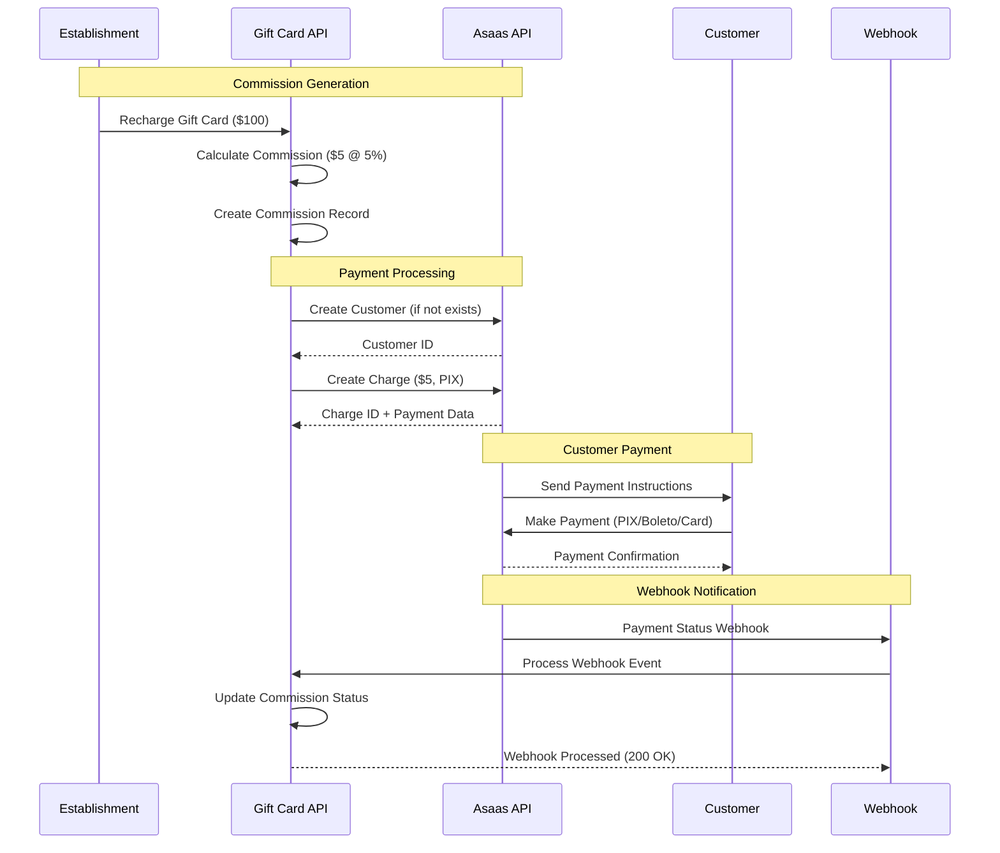

# Payment Integration Module Documentation

The Payment Integration module manages all external payment processing through the Asaas API, handling commission
charges, customer management, and webhook processing for real-time payment status updates.

## Module Overview

**Location**: `app/modules/asaas/`  
**Status**: ✅ **Fully Implemented**  
**External Service**: Asaas Payment Gateway  
**Integration Type**: REST API with webhooks

## Architecture

### Module Structure

```
app/modules/asaas/
├── interfaces/
│   └── asaas.interface.ts           # API interface definitions
├── services/
│   ├── asaas-client.service.ts      # Main API client
│   ├── customer/
│   │   └── create-customer.service.ts    # Customer management
│   ├── payment/
│   │   └── create-commission-charge.service.ts  # Payment processing
│   └── webhook/
│       └── process-webhook.service.ts    # Webhook handling
```

### Related Components

```
app/modules/webhook/                 # Webhook endpoints
app/modules/commission/              # Commission management
app/jobs/                           # Background processing
```

## Core Features

### 1. Customer Management

- **Automatic Registration**: Establishments are automatically registered as Asaas customers
- **Customer Synchronization**: Real-time customer data sync with local database
- **Customer Validation**: Ensures customer exists before payment processing

### 2. Payment Processing

- **Multiple Payment Methods**: PIX, Boleto (bank slip), Credit Card
- **Commission Charging**: Automated commission collection from establishments
- **Payment Tracking**: Real-time payment status monitoring
- **Retry Mechanisms**: Automatic retry for failed payment attempts

### 3. Webhook Integration

- **Real-time Updates**: Immediate payment status synchronization
- **Event Processing**: Comprehensive event handling for all payment states
- **Signature Validation**: Secure webhook verification (production ready)
- **Queue Processing**: Asynchronous webhook processing for performance

## Payment Flow Diagram



## Asaas API Client

### Main Client Service

**Location**: `app/modules/asaas/services/asaas-client.service.ts`

```typescript
class AsaasClientService {
  private baseUrl: string
  private apiKey: string
  private environment: 'sandbox' | 'production'

  constructor() {
    this.baseUrl = this.environment === 'production'
      ? 'https://www.asaas.com/api/v3'
      : 'https://sandbox.asaas.com/api/v3'
    this.apiKey = Env.get('ASAAS_API_KEY')
    this.environment = Env.get('ASAAS_ENVIRONMENT', 'sandbox')
  }

  // Customer operations
  async createCustomer(data: CreateCustomerData): Promise<AsaasCustomer>

  async getCustomer(customerId: string): Promise<AsaasCustomer>

  async updateCustomer(customerId: string, data: UpdateCustomerData): Promise<AsaasCustomer>

  // Payment operations
  async createCharge(data: CreateChargeData): Promise<AsaasCharge>

  async getCharge(chargeId: string): Promise<AsaasCharge>

  async deleteCharge(chargeId: string): Promise<void>

  // Webhook operations
  async validateWebhookSignature(payload: string, signature: string): Promise<boolean>
}
```

### Supported Payment Methods

#### 1. PIX (Instant Payment)

```typescript
const pixCharge = await asaasClient.createCharge({
  customer: customerId,
  billingType: 'PIX',
  value: 50.00,
  dueDate: '2025-01-15',
  description: 'Commission payment',
  externalReference: `commission_${commissionId}`
})

// Response includes PIX QR code and copy-paste code
```

#### 2. Boleto (Bank Slip)

```typescript
const boletoCharge = await asaasClient.createCharge({
  customer: customerId,
  billingType: 'BOLETO',
  value: 50.00,
  dueDate: '2025-01-15',
  description: 'Commission payment',
  externalReference: `commission_${commissionId}`
})

// Response includes boleto URL and barcode
```

#### 3. Credit Card

```typescript
const cardCharge = await asaasClient.createCharge({
  customer: customerId,
  billingType: 'CREDIT_CARD',
  value: 50.00,
  dueDate: '2025-01-15',
  description: 'Commission payment',
  externalReference: `commission_${commissionId}`,
  creditCard: {
    holderName: 'John Doe',
    number: '4111111111111111',
    expiryMonth: '12',
    expiryYear: '25',
    ccv: '123'
  }
})
```

## Customer Management

### Create Customer Service

**Location**: `app/modules/asaas/services/customer/create-customer.service.ts`

```typescript
class CreateCustomerService {
  public async execute(establishment: Establishment): Promise<string> {
    // Check if customer already exists
    if (establishment.asaasCustomerId) {
      return establishment.asaasCustomerId
    }

    // Create customer in Asaas
    const customerData = {
      name: establishment.name,
      email: establishment.user.email,
      cpfCnpj: establishment.cnpj,
      phone: establishment.user.phone,
      address: establishment.address.street,
      addressNumber: establishment.address.number,
      complement: establishment.address.complement,
      province: establishment.address.neighborhood,
      city: establishment.address.city,
      state: establishment.address.state,
      postalCode: establishment.address.zipCode
    }

    const customer = await this.asaasClient.createCustomer(customerData)

    // Update establishment with Asaas customer ID
    await this.establishmentRepository.update(establishment.id, {
      asaasCustomerId: customer.id
    })

    return customer.id
  }
}
```

### Customer Data Mapping

```typescript
interface AsaasCustomer {
  id: string
  name: string
  email: string
  cpfCnpj: string
  phone?: string
  mobilePhone?: string
  address?: string
  addressNumber?: string
  complement?: string
  province?: string
  city?: string
  state?: string
  postalCode?: string
  externalReference?: string
  notificationDisabled?: boolean
  additionalEmails?: string
  municipalInscription?: string
  stateInscription?: string
  observations?: string
}
```

## Commission Charging

### Create Commission Charge Service

**Location**: `app/modules/asaas/services/payment/create-commission-charge.service.ts`

```typescript
class CreateCommissionChargeService {
  public async execute(data: ChargeCommissionData): Promise<AsaasCharge> {
    const { commission, paymentMethod, dueDate, creditCard } = data

    // Ensure customer exists
    const customerId = await this.customerService.ensureCustomer(
      commission.establishment
    )

    // Prepare charge data
    const chargeData: CreateChargeData = {
      customer: customerId,
      billingType: this.mapPaymentMethod(paymentMethod),
      value: commission.amount,
      dueDate: format(dueDate, 'yyyy-MM-dd'),
      description: `Commission payment - ${commission.id}`,
      externalReference: `commission_${commission.id}`
    }

    // Add credit card data if applicable
    if (paymentMethod === 'credit_card' && creditCard) {
      chargeData.creditCard = {
        holderName: creditCard.holderName,
        number: creditCard.number,
        expiryMonth: creditCard.expiryMonth,
        expiryYear: creditCard.expiryYear,
        ccv: creditCard.ccv
      }
    }

    // Create charge in Asaas
    const charge = await this.asaasClient.createCharge(chargeData)

    // Update commission with Asaas charge ID
    await this.commissionRepository.update(commission.id, {
      asaasChargeId: charge.id,
      paymentMethod: paymentMethod,
      status: 'charged'
    })

    return charge
  }

  private mapPaymentMethod(method: string): AsaasBillingType {
    const mapping = {
      'ticket': 'BOLETO',
      'pix': 'PIX',
      'credit_card': 'CREDIT_CARD'
    }
    return mapping[method] || 'PIX'
  }
}
```

## Webhook Processing

### Webhook Event Handler

**Location**: `app/modules/asaas/services/webhook/process-webhook.service.ts`

```typescript
class ProcessWebhookService {
  public async execute(webhookData: AsaasWebhookData): Promise<void> {
    const {event, payment} = webhookData

    // Find commission by external reference
    const commission = await this.findCommissionByPayment(payment)

    if (!commission) {
      Logger.warn(`Commission not found for payment ${payment.id}`)
      return
    }

    // Process based on event type
    switch (event) {
      case 'PAYMENT_CONFIRMED':
      case 'PAYMENT_RECEIVED':
        await this.handlePaymentSuccess(commission, payment)
        break

      case 'PAYMENT_OVERDUE':
        await this.handlePaymentOverdue(commission, payment)
        break

      case 'PAYMENT_DELETED':
      case 'PAYMENT_REFUNDED':
        await this.handlePaymentCancellation(commission, payment)
        break

      default:
        Logger.info(`Unhandled webhook event: ${event}`)
    }
  }

  private async handlePaymentSuccess(
    commission: Commission,
    payment: AsaasPayment
  ): Promise<void> {
    await this.commissionRepository.update(commission.id, {
      status: 'paid',
      paidAt: DateTime.fromISO(payment.confirmedDate || payment.clientPaymentDate)
    })

    // Optional: Send notification to franchisee
    await this.notificationService.sendPaymentConfirmation(commission)
  }

  private async handlePaymentOverdue(
    commission: Commission,
    payment: AsaasPayment
  ): Promise<void> {
    // Commission remains in 'charged' status but is now overdue
    // Optional: Send overdue notification
    await this.notificationService.sendOverdueNotification(commission)
  }
}
```

### Supported Webhook Events

```typescript
type AsaasWebhookEvent = 
  | 'PAYMENT_CREATED'
  | 'PAYMENT_AWAITING_PAYMENT'
  | 'PAYMENT_CONFIRMED'
  | 'PAYMENT_RECEIVED'
  | 'PAYMENT_CREDIT_CARD_CAPTURE_REFUSED'
  | 'PAYMENT_AWAITING_CHARGEBACK_REVERSAL'
  | 'PAYMENT_DUNNING_RECEIVED'
  | 'PAYMENT_DUNNING_REQUESTED'
  | 'PAYMENT_BANK_SLIP_VIEWED'
  | 'PAYMENT_CHECKOUT_VIEWED'
  | 'PAYMENT_OVERDUE'
  | 'PAYMENT_DELETED'
  | 'PAYMENT_RESTORED'
  | 'PAYMENT_REFUNDED'
  | 'PAYMENT_RECEIVED_IN_CASH_UNDONE'
  | 'PAYMENT_CHARGEBACK_REQUESTED'
  | 'PAYMENT_CHARGEBACK_DISPUTE'
  | 'PAYMENT_AWAITING_CHARGEBACK_REVERSAL'
  | 'PAYMENT_CHARGEBACK_REVERSED'
  | 'PAYMENT_CHARGEBACK_SETTLED'
```

## Background Job Integration

### Commission Charge Job

**Location**: `app/jobs/commission-charge.job.ts`

```typescript
class CommissionChargeJob {
  public static get key() {
    return 'CommissionCharge'
  }

  public async handle(job: Job<CommissionChargeJobData>) {
    const { commissionId, paymentMethod, dueDate, creditCard } = job.data

    try {
      // Load commission with relationships
      const commission = await this.commissionRepository.findWithRelations(commissionId)
      
      if (!commission) {
        throw new Error(`Commission ${commissionId} not found`)
      }

      // Create charge via Asaas
      const charge = await this.chargeService.execute({
        commission,
        paymentMethod,
        dueDate,
        creditCard
      })

      Logger.info(`Commission ${commissionId} charged successfully: ${charge.id}`)
      
    } catch (error) {
      Logger.error(`Failed to charge commission ${commissionId}:`, error)
      
      // Update commission status to failed
      await this.commissionRepository.update(commissionId, {
        status: 'failed'
      })
      
      throw error // Let queue handle retry
    }
  }
}
```

### Webhook Processing Job

**Location**: `app/jobs/process-webhook.job.ts`

```typescript
class ProcessWebhookJob {
  public static get key() {
    return 'ProcessWebhook'
  }

  public async handle(job: Job<WebhookJobData>) {
    const { webhookId } = job.data

    try {
      // Load webhook data
      const webhook = await this.webhookRepository.find(webhookId)
      
      if (!webhook || webhook.processedAt) {
        return // Already processed
      }

      // Process webhook
      await this.webhookService.execute(webhook.payload)

      // Mark as processed
      await this.webhookRepository.update(webhookId, {
        processedAt: DateTime.now()
      })

      Logger.info(`Webhook ${webhookId} processed successfully`)
      
    } catch (error) {
      Logger.error(`Failed to process webhook ${webhookId}:`, error)
      throw error
    }
  }
}
```

## Configuration & Environment

### Environment Variables

```bash
# Asaas API Configuration
ASAAS_API_KEY=your_api_key_here
ASAAS_ENVIRONMENT=sandbox # or production
ASAAS_WEBHOOK_SECRET=your_webhook_secret

# Webhook URL (for Asaas configuration)
WEBHOOK_BASE_URL=https://yourdomain.com/webhooks
```

### Asaas Environment Setup

```typescript
// config/asaas.ts
export default {
  apiKey: Env.get('ASAAS_API_KEY'),
  environment: Env.get('ASAAS_ENVIRONMENT', 'sandbox'),
  webhookSecret: Env.get('ASAAS_WEBHOOK_SECRET'),
  baseUrl: Env.get('ASAAS_ENVIRONMENT') === 'production'
    ? 'https://www.asaas.com/api/v3'
    : 'https://sandbox.asaas.com/api/v3',
  webhookUrl: `${Env.get('WEBHOOK_BASE_URL')}/webhooks/asaas`
}
```

## Error Handling

### API Error Handling

```typescript
class AsaasApiError extends Error {
  constructor(
    message: string,
    public statusCode: number,
    public asaasErrors: AsaasError[]
  ) {
    super(message)
  }
}

// Error response format from Asaas
interface AsaasError {
  code: string
  description: string
}
```

### Common Error Scenarios

- **Invalid Customer Data**: Returns 400 with validation errors
- **Insufficient Customer Info**: Returns 400 when required fields are missing
- **Payment Processing Failed**: Returns 422 when payment cannot be processed
- **Webhook Signature Invalid**: Returns 401 when signature validation fails

## Security Considerations

### Webhook Security

```typescript
class WebhookValidator {
  public async validateSignature(
    payload: string, 
    signature: string
  ): Promise<boolean> {
    const secret = Env.get('ASAAS_WEBHOOK_SECRET')
    const expectedSignature = crypto
      .createHmac('sha256', secret)
      .update(payload)
      .digest('hex')
    
    return crypto.timingSafeEqual(
      Buffer.from(signature),
      Buffer.from(expectedSignature)
    )
  }
}
```

### API Key Security

- **Environment-based**: API keys stored in environment variables
- **Rotation Support**: Easy API key rotation without code changes
- **Sandbox/Production**: Separate keys for different environments

## Performance Optimization

### Caching Strategy

- **Customer Data**: Cache customer information for 1 hour
- **Payment Status**: Real-time updates via webhooks (no caching)
- **API Rate Limiting**: Respect Asaas rate limits with queue throttling

### Queue Configuration

```typescript
// Queue settings for Asaas operations
const asaasQueue = {
  rateLimiter: {
    max: 10, // Max 10 requests per interval
    duration: 1000 // 1 second interval
  },
  backoff: {
    type: 'exponential',
    delay: 2000 // Start with 2 second delay
  },
  attempts: 3 // Retry up to 3 times
}
```

## Integration Testing

### Test Environment Setup

```typescript
// For testing, use Asaas sandbox
const testConfig = {
  apiKey: 'test_api_key',
  environment: 'sandbox',
  baseUrl: 'https://sandbox.asaas.com/api/v3'
}
```

### Mock Webhook Testing

```typescript
// Test webhook processing with mock data
const mockWebhook = {
  event: 'PAYMENT_CONFIRMED',
  payment: {
    id: 'pay_test_123',
    value: 50.00,
    status: 'RECEIVED',
    externalReference: 'commission_1'
  }
}
```

## Future Enhancements

### Planned Features

1. **Recurring Payments**: Support for subscription-based commissions
2. **Split Payments**: Multi-party payment splitting
3. **Advanced Analytics**: Payment pattern analysis
4. **Mobile SDKs**: Direct mobile payment integration
5. **Alternative Payment Methods**: Support for additional payment providers

### API Enhancements

1. **Batch Operations**: Bulk payment processing
2. **Payment Links**: Direct payment link generation
3. **Installment Support**: Split payment into installments
4. **Advanced Webhooks**: Custom webhook configurations
5. **Real-time Notifications**: WebSocket-based payment updates

---

*The Payment Integration module provides robust, secure, and scalable payment processing with comprehensive webhook
handling and real-time status synchronization through the Asaas payment gateway.*
