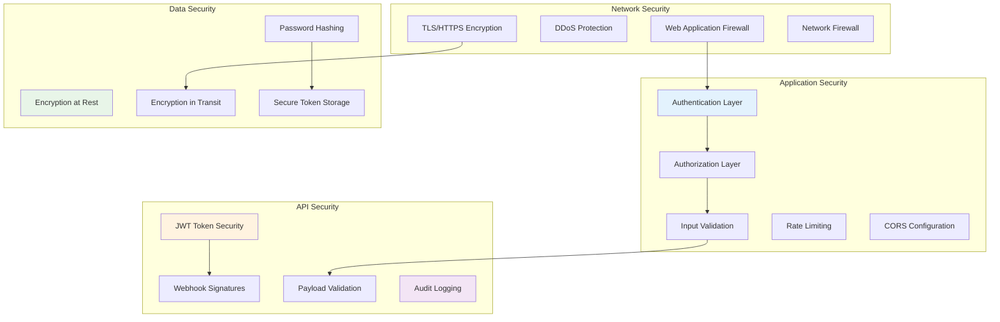

# Security Overview

This document outlines the comprehensive security measures implemented in the gift card platform, including
authentication, authorization, data protection, and compliance considerations.

## Security Architecture

The platform implements multiple layers of security following defense-in-depth principles:

### Security Layers Diagram



## Authentication System

### JWT-Based Authentication

The platform uses JSON Web Tokens (JWT) for stateless authentication with the following characteristics:

#### Token Structure

```typescript
interface JWTPayload {
  sub: string        // User ID
  email: string      // User email
  role: UserRole     // User role (franchisor, franchisee, establishment)
  iat: number        // Issued at timestamp
  exp: number        // Expiration timestamp
  jti: string        // JWT ID (for revocation)
}
```

#### Token Security Features

- **HS256 Algorithm**: HMAC with SHA-256 for token signing
- **Configurable Expiration**: Default 24-hour token lifetime
- **Secure Storage**: Tokens stored in httpOnly cookies (web) or secure storage (mobile)
- **Automatic Refresh**: Refresh mechanism to maintain sessions ⚠️ *Currently placeholder*

### Password Security

#### Password Hashing

```typescript
// Using AdonisJS Hash provider with bcrypt
const hashedPassword = await Hash.make(plainTextPassword)
const isValid = await Hash.verify(hashedPassword, plainTextPassword)
```

**Configuration**:

- **Algorithm**: bcrypt with salt rounds (configurable)
- **Salt Rounds**: Minimum 12 rounds (production recommended)
- **Pepper**: Additional secret key for enhanced security

#### Password Requirements

- **Minimum Length**: 8 characters
- **Complexity**: Mixed case, numbers, and special characters recommended
- **Common Password Protection**: Protection against common passwords
- **History Prevention**: Users cannot reuse last 5 passwords ⚠️ *Not implemented*

### Multi-Factor Authentication ⚠️

*Planned for future implementation*

## Authorization System

### Role-Based Access Control (RBAC)

The platform implements a three-tier role system:

#### User Roles

```typescript
enum UserRole {
  FRANCHISOR = 'franchisor',      // System administrators
  FRANCHISEE = 'franchisee',      // Franchise owners
  ESTABLISHMENT = 'establishment'  // Local businesses
}
```

#### Permission Matrix

| Resource           | Franchisor | Franchisee                | Establishment |
|--------------------|------------|---------------------------|---------------|
| **Users**          | CRUD       | Read (own)                | Read (own)    |
| **Franchisees**    | CRUD       | Read (own)                | None          |
| **Establishments** | CRUD       | CRUD (own)                | Read (own)    |
| **Gift Cards**     | Read All   | CRUD (own establishments) | CRUD (own)    |
| **Transactions**   | Read All   | Read (own)                | Read (own)    |
| **Commissions**    | Read All   | Read (own)                | None          |
| **System Config**  | CRUD       | None                      | None          |

#### ACL Middleware Implementation

```typescript
// app/middleware/acl.middleware.ts
class AclMiddleware {
  public async handle(
    ctx: HttpContext,
    next: NextFn,
    guards: string[]
  ) {
    const user = ctx.auth.user!
    const requiredRoles = guards

    if (!requiredRoles.includes(user.role)) {
      throw new ForbiddenException('Insufficient permissions')
    }

    // Add user context for downstream services
    ctx.loggedUser = user
    await next()
  }
}
```

### Resource-Based Authorization

Beyond role-based access, the platform implements resource-based authorization:

#### Ownership Validation

```typescript
// Example: Franchisee can only access their own establishments
class EstablishmentPolicy {
  public async view(user: User, establishment: Establishment): Promise<boolean> {
    if (user.role === 'franchisor') return true
    if (user.role === 'franchisee') {
      return establishment.franchiseeId === user.franchisee?.id
    }
    if (user.role === 'establishment') {
      return establishment.userId === user.id
    }
    return false
  }
}
```

## Data Protection

### Encryption Standards

#### Encryption at Rest

- **Database**: AES-256 encryption for sensitive fields
- **File Storage**: S3 server-side encryption (SSE-S3)
- **Backups**: Encrypted database backups
- **Logs**: Encrypted log storage

#### Encryption in Transit

- **HTTPS/TLS 1.3**: All API communications encrypted
- **Database Connections**: SSL/TLS encrypted connections
- **Internal Services**: Service-to-service encryption
- **Webhooks**: HTTPS-only webhook endpoints

### Sensitive Data Handling

#### PII (Personally Identifiable Information)

```typescript
// Sensitive fields in database
interface SensitiveData {
  email: string      // Hashed in logs
  phone: string      // Masked in responses
  cnpj: string       // Validated and formatted
  address: object    // Structured and validated
}
```

#### Data Masking

```typescript
// Example of data masking in API responses
const maskEmail = (email: string): string => {
  const [username, domain] = email.split('@')
  return `${username.slice(0, 2)}***@${domain}`
}

const maskPhone = (phone: string): string => {
  return phone.replace(/(\d{2})\d{5}(\d{4})/, '$1*****$2')
}
```

### LGPD Compliance (Brazilian Data Protection)

#### Data Subject Rights

- **Right to Access**: Users can request their data
- **Right to Rectification**: Users can update their information
- **Right to Erasure**: Users can request data deletion ⚠️ *Partial implementation*
- **Right to Portability**: Data export functionality ⚠️ *Not implemented*

#### Consent Management

```typescript
interface ConsentRecord {
  userId: number
  purpose: string
  consentGiven: boolean
  timestamp: DateTime
  ipAddress: string
  userAgent: string
}
```

#### Data Retention Policies

- **Active Users**: Data retained while account is active
- **Inactive Users**: Data retention for 7 years (regulatory requirement)
- **Transaction Data**: Permanent retention for financial records
- **Log Data**: 90-day retention for security logs

## API Security

### Input Validation

#### Request Validation

```typescript
// Using Vine validator for comprehensive input validation
class GiftCardValidator {
  public static createSchema = vine.object({
    franchiseeId: vine.number().exists('franchisees', 'id'),
    establishmentId: vine.number().exists('establishments', 'id'),
    initialValue: vine.number().min(1).max(10000),
    validUntil: vine.date().after('today').optional()
  })
}
```

#### SQL Injection Prevention

- **Parameterized Queries**: All database queries use parameterized statements
- **ORM Protection**: Lucid ORM provides built-in SQL injection protection
- **Input Sanitization**: All user inputs are sanitized and validated

#### XSS Prevention

- **Output Encoding**: All API responses are properly encoded
- **Content Security Policy**: CSP headers for web clients
- **Input Sanitization**: HTML and script tag filtering

### Rate Limiting

#### API Rate Limits

```typescript
// Planned rate limiting configuration
const rateLimits = {
  authentication: {
    windowMs: 60 * 1000,     // 1 minute window
    max: 5,                  // 5 attempts per window
    skipSuccessfulRequests: true
  },
  api: {
    windowMs: 60 * 1000,     // 1 minute window
    max: 100,                // 100 requests per minute
    standardHeaders: true
  },
  publicApi: {
    windowMs: 60 * 1000,     // 1 minute window
    max: 20,                 // 20 requests per minute (balance checks)
    keyGenerator: (request) => request.ip
  }
}
```

### CORS Configuration

```typescript
// config/cors.ts
export default {
  enabled: true,
  origin: [
    'https://yourdomain.com',
    'https://app.yourdomain.com'
  ],
  methods: ['GET', 'HEAD', 'POST', 'PUT', 'DELETE'],
  headers: true,
  exposeHeaders: ['X-Request-Id'],
  credentials: true,
  maxAge: 90
}
```

## Webhook Security

### Signature Validation

#### Asaas Webhook Verification

```typescript
class WebhookValidator {
  public async validateAsaasSignature(
    payload: string,
    signature: string
  ): Promise<boolean> {
    const secret = Env.get('ASAAS_WEBHOOK_SECRET')

    if (!secret) {
      Logger.warn('ASAAS_WEBHOOK_SECRET not configured')
      return false
    }

    const expectedSignature = crypto
      .createHmac('sha256', secret)
      .update(payload)
      .digest('hex')

    return crypto.timingSafeEqual(
      Buffer.from(signature),
      Buffer.from(`sha256=${expectedSignature}`)
    )
  }
}
```

#### Webhook Security Best Practices

- **HTTPS Only**: All webhook URLs must use HTTPS
- **Signature Verification**: All webhook payloads are cryptographically verified
- **Idempotency**: Duplicate webhook handling prevention
- **Timeout Protection**: Webhook processing timeouts to prevent DoS
- **Rate Limiting**: Webhook endpoint rate limiting

## Audit and Monitoring

### Security Logging

#### Audit Trail

```typescript
interface AuditLog {
  id: string
  userId?: number
  action: string
  resource: string
  resourceId?: string
  ipAddress: string
  userAgent: string
  timestamp: DateTime
  metadata?: Record<string, any>
}
```

#### Security Events

- **Authentication Events**: Login attempts, token refresh, logout
- **Authorization Failures**: Permission denied events
- **Data Access**: Sensitive data access logging
- **Administrative Actions**: User management, system configuration changes
- **Suspicious Activity**: Multiple failed logins, unusual access patterns

### Monitoring and Alerting

#### Security Metrics

- **Failed Authentication Rate**: Monitor brute force attempts
- **API Error Rates**: Detect potential attacks
- **Unusual Access Patterns**: Geographic or time-based anomalies
- **Resource Access Patterns**: Detect privilege escalation attempts

#### Alert Conditions

```typescript
const securityAlerts = {
  multipleFailedLogins: {
    threshold: 5,
    timeWindow: '5 minutes',
    action: 'temporary_lockout'
  },
  unusualApiUsage: {
    threshold: 1000,
    timeWindow: '1 hour',
    action: 'rate_limit_enforcement'
  },
  suspiciousWebhooks: {
    threshold: 10,
    timeWindow: '1 minute',
    action: 'webhook_validation_strict'
  }
}
```

## Incident Response

### Security Incident Procedures

#### Incident Classification

1. **Low**: Minor security policy violations
2. **Medium**: Successful unauthorized access attempts
3. **High**: Data breach or system compromise
4. **Critical**: Large-scale data breach or service disruption

#### Response Procedures

1. **Detection**: Automated monitoring and manual reporting
2. **Containment**: Immediate threat isolation
3. **Eradication**: Remove threat and vulnerabilities
4. **Recovery**: Restore services and verify security
5. **Lessons Learned**: Post-incident analysis and improvements

### Breach Notification

#### LGPD Compliance

- **Authority Notification**: Report to ANPD within 24 hours
- **User Notification**: Notify affected users within 72 hours
- **Documentation**: Maintain detailed incident records
- **Remediation**: Implement corrective measures

## Security Testing

### Automated Security Testing

#### Static Analysis

- **Code Scanning**: Automated vulnerability scanning in CI/CD
- **Dependency Scanning**: Third-party library vulnerability detection
- **Secret Scanning**: Detection of hardcoded secrets
- **SAST Tools**: Static Application Security Testing integration

#### Dynamic Testing

- **OWASP ZAP**: Automated penetration testing
- **API Security Testing**: Endpoint security validation
- **Load Testing**: Security under load conditions

### Manual Security Reviews

#### Code Review Process

- **Security-focused Reviews**: Security expert involvement in code reviews
- **Threat Modeling**: Regular threat model updates
- **Penetration Testing**: Quarterly external security assessments
- **Security Architecture Review**: Annual architecture security review

## Compliance and Standards

### Security Standards Adherence

#### OWASP Top 10 Mitigation

- **A01:2021 - Broken Access Control**: RBAC and resource-based authorization
- **A02:2021 - Cryptographic Failures**: Strong encryption standards
- **A03:2021 - Injection**: Parameterized queries and input validation
- **A04:2021 - Insecure Design**: Security-by-design principles
- **A05:2021 - Security Misconfiguration**: Secure defaults and configuration management
- **A06:2021 - Vulnerable Components**: Dependency scanning and updates
- **A07:2021 - Identification and Authentication Failures**: Strong authentication
- **A08:2021 - Software and Data Integrity Failures**: Webhook signature validation
- **A09:2021 - Security Logging and Monitoring Failures**: Comprehensive logging
- **A10:2021 - Server-Side Request Forgery**: Input validation and allow-listing

#### Payment Security Standards

- **PCI DSS Compliance**: Secure payment data handling (via Asaas)
- **Tokenization**: Credit card tokenization through payment processor
- **Secure Communications**: HTTPS for all payment-related communications

## Security Configuration

### Environment-Based Security

#### Production Security Requirements

```bash
# Required security environment variables
JWT_SECRET=random_256_bit_secret
ASAAS_WEBHOOK_SECRET=webhook_signing_secret
DB_ENCRYPTION_KEY=database_encryption_key
SESSION_SECRET=session_encryption_secret

# Security headers
SECURITY_HEADERS_ENABLED=true
HSTS_MAX_AGE=31536000
CSP_ENABLED=true
```

#### Security Headers

```typescript
const securityHeaders = {
  'Strict-Transport-Security': 'max-age=31536000; includeSubDomains',
  'X-Content-Type-Options': 'nosniff',
  'X-Frame-Options': 'DENY',
  'X-XSS-Protection': '1; mode=block',
  'Referrer-Policy': 'strict-origin-when-cross-origin',
  'Content-Security-Policy': "default-src 'self'"
}
```

## Future Security Enhancements

### Planned Security Features

1. **Multi-Factor Authentication**: SMS/TOTP-based 2FA
2. **Advanced Threat Detection**: Machine learning-based anomaly detection
3. **Zero Trust Architecture**: Micro-segmentation and continuous verification
4. **Biometric Authentication**: Mobile biometric integration
5. **Blockchain Integration**: Immutable audit trails

### Security Roadmap

1. **Q1 2025**: Implement MFA and advanced rate limiting
2. **Q2 2025**: Deploy advanced monitoring and threat detection
3. **Q3 2025**: Complete LGPD compliance implementation
4. **Q4 2025**: Zero trust architecture migration

---

*Security is an ongoing process. This document represents the current security posture and planned enhancements. Regular
security reviews and updates are essential for maintaining platform security.*
